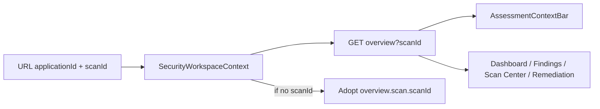
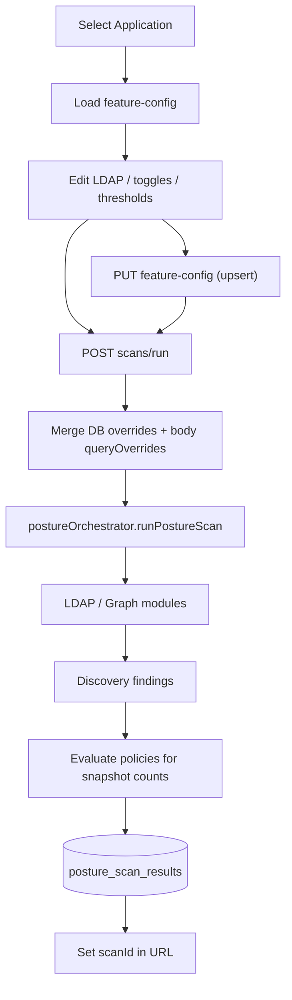
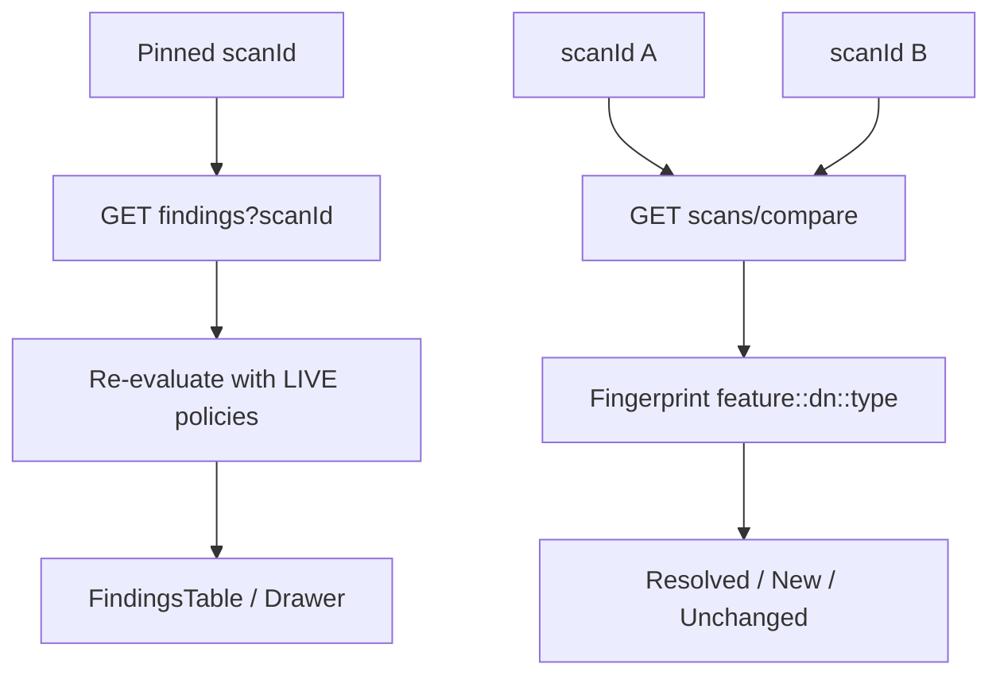
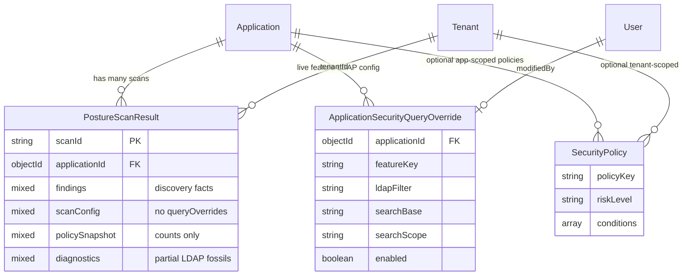

# AD Security Assessment & Scan Center — Architecture Discovery

**Document type:** Architecture discovery / analysis only  
**Status:** No implementation. No code changes. No UI. No new architecture design.  
**Audience:** Engineers and architects evaluating whether Assessments are first-class, partial, or scan snapshots with product naming  
**Codebase root:** `Wisibility_IGA`  
**Related:** `AD_SECURITY_REMEDIATION_ARCHITECTURE_ANALYSIS.md`, `AD_SECURITY_ASSESSMENT_CENTRIC_ARCHITECTURE_ANALYSIS.md` (separate proposal — not current state)  
**Analyzed date:** 2026-07-22  

---

## Executive Verdict

**Assessments are not first-class in the current implementation.**

What the product calls an “Assessment” is a **UI/product label** over a **`PostureScanResult` scan snapshot** (`scanId`). There is **no** Assessment mongoose model, **no** Assessment Version, **no** Assessment Execution entity, and **no** Assessment CRUD API.

| Product language | Actual persistence |
|---|---|
| Assessment | `posture_scan_results` document (`scanId`) |
| Assessment history | Paginated list of scans for an application |
| Use assessment | Pin `scanId` in the URL |
| Assessment context | App name + scan timestamp + finding count |
| Assessment comparison | Fingerprint diff of two scan finding sets |
| Assessment configuration | Live mutable `application_security_query_overrides` + app settings |

**Scan Center** is a feature-configuration and scan-execution workspace scoped to an **Application**, not an Assessment lifecycle workspace.

---

## Table of contents

1. [Current Architecture](#1-current-architecture)
2. [Data Flow](#2-data-flow)
3. [Entity Relationship](#3-entity-relationship)
4. [API Inventory](#4-api-inventory)
5. [Frontend Inventory](#5-frontend-inventory)
6. [Backend Inventory](#6-backend-inventory)
7. [Database Inventory](#7-database-inventory)
8. [Strengths](#8-strengths)
9. [Weaknesses](#9-weaknesses)
10. [Missing Assessment Concepts](#10-missing-assessment-concepts)
11. [Reuse Opportunities](#11-reuse-opportunities)
12. [Risks](#12-risks)
13. [Recommended Refactoring Strategy](#13-recommended-refactoring-strategy)

---

# 1. Current Architecture

## 1.1 Product surface

**Shell:** `icm-frontend/src/pages/security/SecurityCenter.jsx`  
Wraps all `/security/*` routes in `SecurityWorkspaceProvider`.

**Primary Scan Center route:** `/security/scans` → `pages/security/scans/ScanCenter.jsx`

**Sidebar (AD SECURITY):** Dashboard, Findings Explorer, Scan Center, Remediation, Policy Center, Group Intelligence  
(`icm-frontend/src/layouts/Sidebar.jsx`)

**Shared URL workspace state:**

| Param | Owned by | Meaning |
|---|---|---|
| `applicationId` | `SecurityWorkspaceContext` | Selected AD application |
| `scanId` | `SecurityWorkspaceContext` | Pinned scan snapshot (“active assessment”) |
| `baselineScanId` | Remediation Center only | Baseline for progress compare — **not** in workspace context |
| `feature`, `highlight`, `search` | Findings / deep-links | Investigation filters |
| `compareLeft` / `compareRight` | Written by some navigations | **Not consumed** by Findings Explorer or Compare panel init |

## 1.2 What is currently considered an Assessment?

In product copy and component names:

- “Assessment context”
- “Assessment history”
- “Use assessment”
- “Assessment completed successfully”
- “Assessment comparison”
- Compare API messages: “Need at least two assessments…”

**Technically:** an Assessment **is** a completed (or listed) **`PostureScanResult`** identified by `scanId`, belonging to an `applicationId`.

There is **no** Assessment name, owner, purpose, lifecycle status, version number, or immutable configuration document.

## 1.3 What is currently considered a Scan?

A **Scan** is:

1. An **execution** of one or more posture features against an application (LDAP and/or Identity Graph).
2. A **persisted snapshot** in `posture_scan_results`.
3. The unit of history, overview, findings, delete, and compare.

Scan Center is named for this concept. The run endpoint is `POST …/scans/run`. The store and model are scan-centric.

**Conclusion:** Scan = real domain object. Assessment = synonym used in UX.

## 1.4 Relationship: Application · Assessment · Scan · Execution · Findings · Comparison

```
Application
  │
  ├── Live Feature Configuration  (mutable; NOT tied to a scan)
  │     application_security_query_overrides
  │     Application.securityScanSettings
  │
  ├── Scans / “Assessments”  (PostureScanResult × N)
  │     scanId
  │       ├── findings[]          (discovery facts)
  │       ├── scanConfig          (partial run metadata)
  │       ├── diagnostics[]       (partial LDAP fossils)
  │       ├── policySnapshot      (counts only)
  │       └── summary
  │
  └── Live Security Policies      (mutable; re-applied at read time)
        security_policies
```

| Concept | Exists as entity? | Implemented as |
|---|---|---|
| Application | Yes | Application model |
| Assessment | **No** | Label for Scan |
| Assessment Version | **No** | — |
| Assessment Execution | **No** | Scan itself |
| Scan | Yes | `PostureScanResult` |
| Findings | Embedded | On scan document; re-scored on read |
| Comparison | Derived | Two `scanId`s → fingerprint buckets |

There is **no separate Execution** under an Assessment. The scan **is** the execution.

## 1.5 How Scan Center works (current UX)

Top → bottom in `ScanCenter.jsx`:

1. **Header** (`ScanCenterHeader`) — application picker, Run full / Run selected, refresh, last-scan stats  
2. **Assessment Context Bar** — pinned scan identity (app · time · findings)  
3. Optional in-progress / diagnostics from overview  
4. **Feature Workspace** (`ScanCenterFeatureWorkspace`)  
   - Category sidebar (`scanCenterCategories.js`)  
   - Feature table (enabled toggle, last-run from history)  
   - Detail panel (`SecurityFeatureDetailPanel`)  
   - LDAP editors (`FeatureQueryConfigurationPanel`): Search Base, Search Scope, LDAP filter  
5. **Assessment history** table — list scans; **Use assessment** = `setScanId`; Delete; Compare navigates to Dashboard with compare params  

**Important:** Feature configuration is available as soon as an application is selected. There is **no** “create or select Assessment” gate before configuration or run.

## 1.6 Feature configuration & LDAP persistence

| Concern | Storage | Scope |
|---|---|---|
| LDAP filter / Search Base / Search Scope / enabled | `application_security_query_overrides` | Per `(applicationId, featureKey)` |
| Inactive days / OS tokens / OU patterns | `Application.securityScanSettings` | Per application |
| Registry defaults | Code (`postureFeatureRegistry`) | Global |
| Per-run body overrides | Request `queryOverrides` | Ephemeral (merged at run; **not** written onto scan doc) |

**Versioned?** No. Upsert overwrites the same override row.

**Upsert-before-run:** `useSecurityFeatureActions.runFeatureScan` saves feature config to the DB **before** calling `runScan`. Draft editing and execution share one write path.

## 1.7 Are configurations versioned?

**No.**

- No Assessment Version document  
- No config snapshot FK on the scan  
- `scanConfig` stores `requestedFeatures` + `featureSettings` but **not** `queryOverrides`  
- Diagnostics may fossilize `ldapFilter` / `searchBase` / `searchScope` per feature as runtime evidence — useful archaeology, not a contract for reproducibility  

## 1.8 Can Scan Center reproduce the same assessment consistently?

**Not reliably.**

| Required for reproducibility | Present? |
|---|---|
| Same feature set | Partially (`scanConfig.requestedFeatures`) |
| Same LDAP filters / bases / scopes | **No** first-class freeze (diagnostics only) |
| Same thresholds | Partially (`featureSettings` on that scan) |
| Same policy documents for scoring | **No** (live re-eval) |
| Same AD directory state | External (directory changes over time) |
| “Use assessment” restores config into editors | **No** — only pins `scanId` for findings/overview |

Re-running after config edits produces a **new** scan with different effective queries. Comparing two scans after config drift can misattribute “resolved/new” to filter changes rather than remediation.

## 1.9 What is mutable today?

| Artifact | Mutable? |
|---|---|
| Feature LDAP overrides | Yes — anytime |
| Feature enabled flags | Yes |
| App security scan settings | Yes |
| Security policies | Yes — affects historical read severity |
| Pinned `scanId` in URL | Yes (selection) |
| Scan documents (findings facts) | Practically append-only new UUID; upsert-by-scanId exists; delete supported |
| Registry feature definitions | Code deploy |

## 1.10 What should be immutable? (discovery implication — not a design)

From how the product **talks** about assessments (historical posture, comparison, remediation progress), the following are **treated as immutable in language but are not enforced in data**:

- Configuration that produced a given assessment  
- Policy set used to score that assessment  
- Findings identity set for that execution  

Today only **discovery findings** on the scan document are effectively frozen; scoring and configuration are not.

## 1.11 APIs: Assessment concepts vs Scan concepts

| Assessment-like (naming only) | Scan-native (actual) |
|---|---|
| Compare messages say “assessments” | `GET/POST/DELETE …/scans…` |
| Remediation “baseline/current assessment” | Params are still scan ids |
| Overview “previous assessment” deltas | Previous **scan** |
| — | Feature-config CRUD |
| — | Run scan |
| — | Findings by `scanId` |

**No Assessment APIs exist** (`/assessments`, version freeze, execution under assessment, etc.).

---

# 2. Data Flow

## 2.1 Workspace selection



## 2.2 Configure + execute (Scan Center)



## 2.3 Investigate / compare



## 2.4 Remediation progress (adjacent, scan-based)

Remediation Center (`/security/remediation`) selects baseline + current **scan ids**, calls remediation-summary which **maps** Compare API output. It does not introduce Assessment entities.

---

# 3. Entity Relationship

## 3.1 As implemented



## 3.2 Conceptual mapping (product vs data)

```
Product:   Application → Assessment → Execution → Findings → Compare
Actual:    Application → (missing) → Scan(=Execution) → Findings → Compare(scans)
Config:    Application → Live Overrides  (not Assessment Version)
```

## 3.3 Answers to the relationship questions

1. **Assessment?** UI name for a scan snapshot.  
2. **Scan?** First-class persisted execution + finding store.  
3. **Application → Assessment → Scan → Execution → Findings → Comparison?**  
   Collapses to **Application → Scan → Findings → Compare(scan, scan)**. Assessment and Execution are not distinct layers.

---

# 4. API Inventory

**Mount:** `/api/security` → `icm-backend/src/routes/securityRoutes.js`

| Method | Path | Supports Assessment entity? | Supports Scan concept? | Notes |
|---|---|---|---|---|
| GET | `/applications/:id/overview` | Naming only | Yes | Optional `scanId` |
| GET | `/applications/:id/findings` | No | Yes | Re-scores live |
| GET | `/applications/:id/scans` | No | Yes | History |
| GET | `/applications/:id/scans/compare` | Naming in messages | Yes | Two scan ids |
| GET | `/applications/:id/scans/:scanId` | No | Yes | Full blob |
| DELETE | `/applications/:id/scans/:scanId` | No | Yes | |
| POST | `/applications/:id/scans/run` | No | Yes | Execution |
| GET | `/applications/:id/feature-config` | No | Config for next scans | Live |
| PUT | `/applications/:id/feature-config/:featureKey` | No | Mutates live config | |
| POST | `/applications/:id/query/test` | No | LDAP test | |
| POST | `/query/validate` | No | Validate filter | |
| GET/CRUD | `/policies…` | No | Scoring rules | Live |
| GET | `/applications/:id/remediation-summary` | Progress wording | Yes | Uses compare of scans |
| GET | `/remediation/applications-summary` | Progress wording | Yes | Per-app last two scans |

**Missing Assessment APIs:** create/list/get Assessment; create/freeze Version; list Executions under Version; immutable config GET; lifecycle transitions.

---

# 5. Frontend Inventory

## 5.1 Core Scan Center / Assessment UX

| Artifact | Path | Role |
|---|---|---|
| Scan Center page | `pages/security/scans/ScanCenter.jsx` | Config + run + history |
| Workspace provider | `pages/security/SecurityWorkspaceContext.jsx` | `applicationId` + `scanId` |
| Security shell | `pages/security/SecurityCenter.jsx` | Provider + Outlet |
| Assessment context | `components/security/AssessmentContextBar.jsx` | Scan identity strip |
| Compare panel | `components/security/AssessmentComparePanel.jsx` | Two-scan compare UI |
| Feature workspace | `components/security/ScanCenterFeatureWorkspace.jsx` | Categories + table + detail |
| Feature detail | `components/security/SecurityFeatureDetailPanel.jsx` | Run / save / evidence |
| LDAP query panel | `components/security/FeatureQueryConfigurationPanel.jsx` | Search Base / Scope / Filter |
| Feature actions hook | `hooks/useSecurityFeatureActions.js` | Upsert-before-run |
| Header | `components/security/ScanCenterHeader.jsx` | App + run controls |
| Categories | `utils/scanCenterCategories.js` | Sidebar taxonomy |
| Feature labels | `pages/security/securityFeatureMeta.js` | Labels / alternate taxonomy |
| API client | `services/securityApi.js` | Scan + config + policies + remediation summary |
| Nav helpers | `utils/securityNavigation.js` | Preserve workspace query params |

## 5.2 Consumers of pinned scan

| Page | How it uses `scanId` |
|---|---|
| Security Dashboard | Overview + compare + top findings |
| Findings Explorer | Paginated findings for scan |
| Scan Center | History pin + diagnostics |
| Remediation Center | Current execution; baseline separate param |
| Feature intelligence views | Often overview/findings with scan context |

## 5.3 Feature Registry (frontend vs backend)

- **Backend registry** is source of truth for executable features (`postureFeatureRegistry` and modules).  
- Frontend receives feature tiles via **feature-config** payload (registry ∪ overrides).  
- Category grouping is a **frontend** concern (`scanCenterCategories.js`).

## 5.4 State management

- **URL:** primary workspace continuity  
- **React Query:** overview, findings, scans, feature-config, compare, remediation-summary  
- **Local component state:** selected feature, compare picker, history pagination  
- **sessionStorage:** remediation pair only (`AssessmentPairSelector`) — not Scan Center  

## 5.5 Routing / Sidebar

All under `/security` + `SecurityWorkspaceProvider`. Sidebar preserves `location.search` when navigating between security items (commented as Assessment workspace continuity — meaning **scan** continuity).

---

# 6. Backend Inventory

| Layer | Path | Role |
|---|---|---|
| Routes | `routes/securityRoutes.js` | HTTP surface |
| Controllers | `controllers/securityController.js`, `securityQueryController.js`, `securityPolicyController.js` | HTTP adapters |
| Orchestrator | `services/posture/postureOrchestrator.js` | Run modules; build scan payload |
| Scan store | `services/posture/postureScanResultsStore.js` | Persist/list/get/delete scans |
| Findings / compare | `services/security/securityFindingsService.js` | Overview, findings, fingerprint compare |
| Query overrides | `services/security/applicationSecurityQueryService.js` | Load/upsert/merge overrides |
| Policy engine | `services/security/securityPolicyEngine.js` | Discovery strip + evaluate |
| Policy service | `services/security/securityPolicyService.js` | Load policies |
| Feature registry | `services/posture/postureFeatureRegistry.js` | Feature catalog |
| Remediation mapper | `services/security/securityRemediationSummaryService.js` | Compare → progress widgets |
| Models | `models/security/PostureScanResult.js`, `ApplicationSecurityQueryOverride.js`, `SecurityPolicy.js` | Persistence |

**Not present:** Assessment services, version freeze services, execution-under-assessment services.

---

# 7. Database Inventory

| Collection | Model | Assessment-related? | Role |
|---|---|---|---|
| `posture_scan_results` | `PostureScanResult` | De facto “assessment” store | Scan snapshots + findings |
| `application_security_query_overrides` | `ApplicationSecurityQueryOverride` | Live config | Search Base / Scope / LDAP / enabled |
| `security_policies` | `SecurityPolicy` | Scoring | Live policies |
| Identity graph collections | Graph models | Detection input | Not assessment entities |
| `workflow_task_queue` | Queue model | Remediation | Not assessment config |
| — | — | **No assessment collections** | — |

### `posture_scan_results` — fields of interest

| Field | Assessment usefulness |
|---|---|
| `scanId` | Primary key (= “assessment id” in UI) |
| `findings` | Frozen discovery facts |
| `scanConfig.requestedFeatures` | Partial feature set |
| `scanConfig.featureSettings` | Partial thresholds |
| `diagnostics` | Partial LDAP fossils |
| `policySnapshot` | Count metadata only — **not** policy docs |
| Missing `queryOverrides` | Cannot reconstruct exact LDAP from scanConfig alone |

---

# 8. Strengths

1. **Clear scan snapshot model** — one document per run; easy history and pin.  
2. **Mature detection stack** — Feature Registry, LDAP modules, graph intelligence, diagnostics.  
3. **Workspace continuity** — `applicationId`/`scanId` shared across Dashboard, Findings, Scan Center, Remediation.  
4. **Compare engine exists** — fingerprint Resolved / New / Unchanged; extended with byFeature / progress for remediation.  
5. **Policy engine separation** — discovery facts vs risk scoring (intentional flexibility).  
6. **Feature config UX** — Search Base / Scope / LDAP editors already productized in Scan Center.  
7. **High reuse surface** — AssessmentContextBar, Compare panel, Findings table, Feature workspace are solid primitives.  
8. **Remediation Center already consumes scan pairs** — proves progress-from-compare without new compare algorithm.

---

# 9. Weaknesses

1. **Assessment is not a business object** — naming ≠ model.  
2. **Config precedes Assessment selection** — Scan Center allows configure/run without Assessment identity.  
3. **Live mutable config** — shared across all future scans for an application.  
4. **Incomplete scanConfig** — `queryOverrides` not persisted on the scan.  
5. **Policy scoring drifts** — historical severity can change when policies change.  
6. **Upsert-before-run** — blurs draft vs definition vs execution.  
7. **“Use assessment” does not restore configuration** — only findings context.  
8. **Compare ignores config equality** — drifted filters can fake remediation progress.  
9. **URL compare params unused** — `compareLeft`/`compareRight` written but not reliably consumed.  
10. **No lifecycle** — Draft / Ready / Running / Under Remediation / Closed do not exist on any Assessment entity.  
11. **Dual taxonomy** — `scanCenterCategories` vs `securityFeatureMeta` FEATURE_CATEGORIES can confuse mapping.  
12. **AssessmentComparePanel** — local state can drift from props/URL after mount.

---

# 10. Missing Assessment Concepts

Exact gaps vs a true Assessment-centric product (discovery of absence — not a design):

| Concept | Status |
|---|---|
| Assessment entity (name, owner, purpose, status) | Missing |
| Assessment Version (immutable config) | Missing |
| Assessment Execution distinct from Version | Missing (scan conflates both) |
| Gate: select/create Assessment before config | Missing |
| Read-only config for existing Assessment | Missing (always editable) |
| Create New Version instead of edit | Missing |
| Frozen queryOverrides on version/execution | Missing |
| Frozen policy documents for scoring | Missing |
| Lifecycle state machine | Missing |
| Compare constrained to same version | Missing |
| Findings required to hang under Execution of a Version | Partial (under scan only) |
| Assessment APIs | Missing |
| Assessment Mongo collections | Missing |

**Partial concepts that look Assessment-like but are not:**

- AssessmentContextBar  
- Assessment history table  
- AssessmentComparePanel  
- Remediation baseline/current pair  

All are **scan-pair / scan-pin UX**.

---

# 11. Reuse Opportunities

When Assessment-centric work is later approved, these are high-value reuse targets (discovery only):

### Reuse as-is (or thin wrap)

| Component / service | Why |
|---|---|
| Feature Registry + detectors | Capability catalog unchanged |
| `postureOrchestrator` | Execution engine |
| `posture_scan_results` | Natural Assessment Execution store (evolve, don’t replace) |
| `securityFindingsService` compare fingerprint | Progress / remediation math |
| `ScanCenterFeatureWorkspace` + LDAP panels | Configuration UI |
| `AssessmentContextBar` | Extend fields (Assessment · Version · Execution) |
| `AssessmentComparePanel` | Constrain to same-version executions |
| Findings Explorer / FindingsTable / RiskDrilldownDrawer | Investigation |
| `SecurityWorkspaceContext` | Extend URL keys; keep provider pattern |
| Remediation Center pair + summary mapper | Already progress-oriented |

### Extend

| Artifact | Likely extension |
|---|---|
| `scanConfig` persistence | Include full overrides used |
| Feature actions hook | Stop upsert-before-run for frozen versions |
| Scan history table | Group under Assessment / Version |
| Overview / findings responses | Carry assessmentId / versionId when present |
| Feature-config APIs | Draft-only vs frozen snapshot load |

### Remain untouched (initially)

| Artifact | Reason |
|---|---|
| Individual LDAP/graph feature modules | Detection correctness |
| Policy condition catalog | Orthogonal |
| Workflow engine / task queue | Remediation execution path |
| Data Hygiene product | Separate domain |
| Identity graph materialization (except scan options) | Infrastructure |

---

# 12. Risks

| Risk | Impact |
|---|---|
| Treating current scans as Assessments without versioning | False remediation progress when LDAP filters change |
| Freezing policy scoring without migration | Historical UI severities may shift vs new frozen model |
| Dual-writing overrides + version config | Drift / which source wins at run time |
| Big-bang rewrite of Scan Center | High regression risk on Feature Registry UX |
| Ignoring diagnostics as “good enough” config history | Incomplete, non-contractual archaeology |
| Remediation Center assuming stable scan pairs | Progress dashboards inherit config-drift risk |
| URL param sprawl (`baselineScanId`, compareLeft/Right) without workspace ownership | Inconsistent context across pages |
| Assuming Assessment-centric analysis docs are “current state” | Those documents are proposals; this discovery is actual |

---

# 13. Recommended Refactoring Strategy

> **Scope note:** This section is a **strategy outline derived from discovery gaps**, not a new target architecture design and not an implementation plan approval. Detailed Assessment-centric design already exists separately; do not implement until explicitly approved.

### Strategy principles (from current state)

1. **Acknowledge the truth:** Scan = Execution snapshot; Assessment language is ahead of the data model.  
2. **Evolve, don’t replace:** Promote `PostureScanResult` into an Execution linked to new Assessment / Version entities; keep orchestrator and detectors.  
3. **Separate concerns that are currently fused:**  
   - Draft / live working config  
   - Immutable Version config  
   - Execution results  
4. **Close the reproducibility hole first in data:** persist effective `queryOverrides` (and eventually policy docs) on Version and/or Execution before gating UX.  
5. **Gate Scan Center interaction flow last:** reuse Feature Workspace; change **when** config is editable and **what** run binds to (Version), not the visual language.  
6. **Harden Compare before marketing progress:** same-version (or same-config) constraint so Remediation Center progress is trustworthy.  
7. **Migrate naming carefully:** keep `scanId` as execution alias for backward compatibility with URL, Findings, Remediation.  
8. **Feature-flag cutover:** dual-read historical scans; require Assessment only when ready.  
9. **Do not invent a second finding engine or second Scan Center.**  
10. **Treat Remediation Center as a consumer** of Assessment → Version → Execution → Compare once those exist — it already consumes scan pairs today.

### Suggested order of concern (not a build schedule)

```
Discovery (this document)
  → Approve target Assessment model (separate architecture)
  → Persist complete execution config snapshot (data honesty)
  → Introduce Assessment + Version entities (additive schema)
  → Bind run path to frozen Version
  → Gate Scan Center UX (selection before editable config)
  → Constrain Compare / Remediation progress to same Version
  → Lifecycle status automation
```

### Explicit non-goals until approved

- Implementing Assessment entities in this discovery phase  
- Redesigning Scan Center visuals  
- Rewriting Findings Explorer or Remediation Center  
- Replacing Compare fingerprint algorithm  

---

## Appendix A — Direct answers (checklist)

| # | Question | Answer |
|---|---|---|
| 1 | What is an Assessment? | UI label for a `PostureScanResult` (`scanId`) |
| 2 | What is a Scan? | First-class persisted posture execution + findings |
| 3 | Relationship | Application → Scans; Assessment/Execution not separate; Findings on scan; Compare between scans |
| 4 | How Scan Center works | App → editable feature config → run scan → history pin scanId |
| 5 | Feature config storage | `application_security_query_overrides` (+ registry defaults) |
| 6 | Search Base / Scope / LDAP | Same override collection fields |
| 7 | Config versioned? | **No** |
| 8 | Reproducible assessments? | **Not reliably** |
| 9 | Mutable today? | Overrides, settings, policies, scan selection |
| 10 | Should be immutable? | Config + scoring used for a historical assessment (product intent; not enforced) |
| 11 | APIs with Assessment concepts? | Naming only on compare/remediation |
| 12 | APIs scan-only? | Essentially all security scan/config/findings APIs |
| 13 | Reuse? | Orchestrator, registry, Scan Center UI, context bar, compare, findings, scan store |
| 14 | Extend? | scanConfig, workspace URL, feature actions, history, context bar, compare guards |
| 15 | Untouched? | Detectors, workflow engine, Data Hygiene, policy condition catalog (initially) |

## Appendix B — Critical file index

### Frontend
- `icm-frontend/src/pages/security/scans/ScanCenter.jsx`
- `icm-frontend/src/pages/security/SecurityWorkspaceContext.jsx`
- `icm-frontend/src/pages/security/SecurityCenter.jsx`
- `icm-frontend/src/components/security/AssessmentContextBar.jsx`
- `icm-frontend/src/components/security/AssessmentComparePanel.jsx`
- `icm-frontend/src/components/security/ScanCenterFeatureWorkspace.jsx`
- `icm-frontend/src/components/security/SecurityFeatureDetailPanel.jsx`
- `icm-frontend/src/components/security/FeatureQueryConfigurationPanel.jsx`
- `icm-frontend/src/hooks/useSecurityFeatureActions.js`
- `icm-frontend/src/services/securityApi.js`
- `icm-frontend/src/utils/scanCenterCategories.js`
- `icm-frontend/src/utils/securityNavigation.js`
- `icm-frontend/src/layouts/Sidebar.jsx`
- `icm-frontend/src/routes/AppRoutes.jsx`

### Backend
- `icm-backend/src/routes/securityRoutes.js`
- `icm-backend/src/controllers/securityController.js`
- `icm-backend/src/controllers/securityQueryController.js`
- `icm-backend/src/services/posture/postureOrchestrator.js`
- `icm-backend/src/services/posture/postureScanResultsStore.js`
- `icm-backend/src/services/security/securityFindingsService.js`
- `icm-backend/src/services/security/applicationSecurityQueryService.js`
- `icm-backend/src/models/security/PostureScanResult.js`
- `icm-backend/src/models/security/ApplicationSecurityQueryOverride.js`
- `icm-backend/src/models/security/SecurityPolicy.js`

---

## Appendix C — One-sentence synthesis

**Scan Center already delivers a strong feature-configuration and scan-execution experience, but Assessments exist only as product language over scan snapshots — configuration is live and unversioned, so historical comparison and remediation progress cannot be treated as trustworthy Assessment semantics until Assessment becomes a first-class, versioned business object.**

---

*End of discovery. No implementation was performed. Awaiting approval before any Assessment-centric design implementation or refactoring.*
