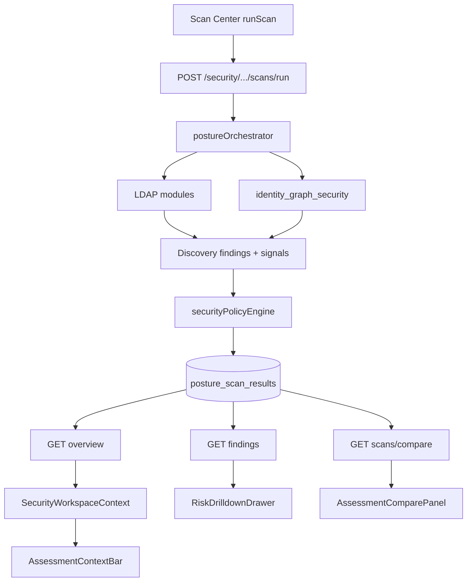

# AD Security Remediation — Architecture Analysis

**Document type:** Discovery / architecture analysis only  
**Status:** No implementation. No UI redesign. No code changes proposed beyond identifying reuse and gaps.  
**Audience:** Engineers who will later design and build an **AD Security Remediation** page that visually resembles Data Hygiene but operates on Active Directory Security Assessments.  
**Codebase root:** `Wisibility_IGA`  
**Analyzed surfaces:** AD Security Center, Data Hygiene, Remediation Framework  

---

## Table of contents

1. [Part 1 — AD Security Architecture](#part-1--ad-security-architecture)
2. [Part 2 — Data Hygiene Architecture](#part-2--data-hygiene-architecture)
3. [Part 3 — Remediation Architecture](#part-3--remediation-architecture)
4. [Part 4 — Reuse Analysis](#part-4--reuse-analysis)
5. [Part 5 — Similarity Matrix](#part-5--similarity-matrix)
6. [Part 6 — Missing Pieces](#part-6--missing-pieces)
7. [Part 7 — Implementation Readiness](#part-7--implementation-readiness)

---

# Part 1 — AD Security Architecture

## 1.1 Purpose

AD Security (Identity Security Posture / Security Center) assesses Active Directory (and related application) security posture by:

1. Running **feature detectors** (LDAP live queries and/or Identity Graph analysis).
2. Emitting **discovery findings** with `findingSignals`.
3. Evaluating findings against **security policies** to assign severity / matched policy.
4. Persisting a **scan snapshot** (`posture_scan_results`).
5. Presenting overview, findings investigation, scan configuration, and policy management in the UI.

It is **assessment-centric**, not remediation-centric. Remediation CTAs exist only in a narrow, optional form (`SecurityFindingRemediateButton`) when a finding already maps to an account/orphan target.

## 1.2 Navigation

**Shell:** `icm-frontend/src/pages/security/SecurityCenter.jsx`  
Wraps all `/security/*` routes in `SecurityWorkspaceProvider`. `/security` redirects to `/security/dashboard`.

**Routes** (`icm-frontend/src/routes/AppRoutes.jsx`):

| Route | Page | Sidebar (AD SECURITY) |
|-------|------|------------------------|
| `/security/dashboard` | `dashboard/SecurityDashboard.jsx` | Yes |
| `/security/findings` | `findings/FindingsExplorer.jsx` | Yes |
| `/security/scans` | `scans/ScanCenter.jsx` | Yes |
| `/security/policies` | `policies/PolicyCenter.jsx` | Yes |
| `/security/groups` | `groups/GroupIntelligenceView.jsx` | Yes |
| `/security/privileged` | `privileged/PrivilegedAccessView.jsx` | No (tile-linked) |
| `/security/acl` | `acl/AclIntelligenceView.jsx` | No |
| `/security/computer` | `computer/ComputerSecurityView.jsx` | No |
| `/security/kerberos` | `kerberos/KerberosSecurityView.jsx` | No |
| `/security/delegation` | `delegation/DelegationSecurityView.jsx` | No |
| `/security/graph` | `graph/GraphExplorerPlaceholder.jsx` | No (stub) |

**Shared URL state:** `?applicationId=&scanId=` (plus optional `feature`, `highlight`, `search`, compare params).  
Sidebar (`layouts/Sidebar.jsx`) preserves `applicationId` / `scanId` when hopping between security routes.

**Not the same product:** `/identities/posture` (Identity Posture scoring) shares vocabulary but not the Security workspace.

## 1.3 React structure

```
SecurityCenter
└── SecurityWorkspaceProvider
    ├── SecurityDashboard
    │   ├── AssessmentContextBar
    │   ├── PrivilegeExposurePanel
    │   ├── AssessmentComparePanel
    │   ├── SecurityMetricCard / ScanStatusBadge
    │   ├── FindingsTable → RiskDrilldownDrawer
    │   ├── SecurityExportMenu / SecurityReportPanel
    │   └── AdaptDashboardTilesDialog
    ├── FindingsExplorer
    │   ├── AssessmentContextBar
    │   ├── FindingsFilters (Category → Feature multi-select)
    │   ├── FindingsTable → RiskDrilldownDrawer
    │   └── SecurityExportMenu
    ├── ScanCenter
    │   ├── ScanCenterHeader
    │   ├── AssessmentContextBar
    │   ├── ScanCenterFeatureWorkspace
    │   │   ├── SecurityFeatureDetailPanel
    │   │   ├── FeatureQueryConfigurationPanel
    │   │   └── useSecurityFeatureActions
    │   └── Scan history table (Use scan / delete)
    ├── PolicyCenter + SecurityPolicyEditorDialog
    ├── GroupIntelligenceView (NestedGroupTree + FindingsTable)
    ├── PrivilegedAccessView (PrivilegePathViewer + FindingsTable)
    ├── AclIntelligenceView
    ├── Computer / Kerberos / Delegation → PostureFeatureTabsView
    └── GraphExplorerPlaceholder
```

**Key shared components** (`icm-frontend/src/components/security/`):

| Component | Role |
|-----------|------|
| `AssessmentContextBar` | Assessment strip (app · time · Findings count; Summary / Investigate) |
| `AssessmentComparePanel` | Left/right scan compare (resolved / new / unchanged) |
| `FindingsTable` / `FindingsFilters` | Investigation grid + filters |
| `RiskDrilldownDrawer` | Finding detail / next steps |
| `SecurityMetricCard` | Dashboard KPI tiles |
| `SecurityFindingRemediateButton` | Thin bridge to queue-first remediate when orphan/account id present |
| Scan Center suite | Feature workspace, LDAP query panel, scan settings |

**State / hooks / utils:**

| Artifact | Path |
|----------|------|
| Workspace context | `pages/security/SecurityWorkspaceContext.jsx` |
| Feature actions | `hooks/useSecurityFeatureActions.js` |
| API client | `services/securityApi.js` |
| Navigation helpers | `utils/securityNavigation.js` |
| Categories / feature maps | `utils/scanCenterCategories.js` |
| Feature labels | `pages/security/securityFeatureMeta.js` |
| Finding types | `pages/security/findingTypeMeta.js` |
| Policy signals | `pages/security/policySignalMeta.js` |

## 1.4 Data flow

### Assessment / workspace flow

1. User selects application → `applicationId` in URL.  
2. Overview loads (`GET …/overview?scanId=`). If no `scanId`, backend resolves latest scan.  
3. Workspace may hydrate empty `scanId` from overview; “Use scan” pins an explicit historical snapshot.  
4. All security pages consume the same `overview` / `scanId` via context.

### Scan flow

1. Scan Center configures features (enabled flags, Search Base / LDAP overrides).  
2. `POST /api/security/applications/:id/scans/run` → `securityController` → `postureOrchestrator.runPostureScan`.  
3. Modules run (LDAP and/or Identity Graph).  
4. Findings evaluated by `securityPolicyEngine` using signals.  
5. One document written to `posture_scan_results`.  
6. UI sets `scanId`, invalidates React Query `["security", …]`.

### Finding / investigation flow

1. `GET …/findings` flattens scan findings, re-applies policies, paginates in memory.  
2. Filters: search, categories→features (comma-separated `feature`), object type.  
3. Row click → `RiskDrilldownDrawer` (evidence, recommendation, deep-links).  
4. Dashboard tiles deep-link into Findings / Groups / Privileged / ACL / etc. with `feature=`.

### Comparison flow

1. `AssessmentComparePanel` (Dashboard; **commented out** on Scan Center).  
2. `GET …/scans/compare?left=&right=`.  
3. Fingerprint: `feature::dn::type` → buckets: resolved / new / unchanged.  
4. Overview also embeds a lighter previous-scan delta (`previousScanId`, feature deltas).



## 1.5 Backend APIs

**Mount:** `/api/security` → `routes/securityRoutes.js`

| Method | Endpoint | Role |
|--------|----------|------|
| GET | `/applications/:applicationId/overview` | Assessment summary + totals + optional comparison summary |
| GET | `/applications/:applicationId/findings` | Paginated findings |
| GET | `/applications/:applicationId/scans` | Scan history |
| GET | `/applications/:applicationId/scans/compare` | Pairwise scan compare |
| GET/DELETE | `/applications/:applicationId/scans/:scanId` | Get / delete snapshot |
| POST | `/applications/:applicationId/scans/run` | Execute scan (long timeout) |
| GET/PUT | `/applications/:applicationId/feature-config[/:featureKey]` | LDAP query overrides |
| POST | `/applications/:applicationId/query/test` | Live LDAP test |
| POST | `/query/validate` | Filter/base/scope validation |
| CRUD | `/policies…` | Security policies |

**Legacy (parallel):** `/api/applications/:id/posture/*` still exists on application routes.

**Controllers:** `securityController.js`, `securityQueryController.js`, `securityPolicyController.js`  
**Core services:** `postureOrchestrator.js`, `securityFindingsService.js`, `securityPolicyEngine.js`, `securityPolicyService.js`, `applicationSecurityQueryService.js`, posture LDAP modules, graph intelligence packages.

## 1.6 Mongo collections / models

| Collection | Model | Role |
|------------|-------|------|
| `posture_scan_results` | `PostureScanResult` | **Primary** scan + embedded findings |
| `security_policies` | `SecurityPolicy` | Risk assignment policies |
| `application_security_query_overrides` | `ApplicationSecurityQueryOverride` | Per-feature LDAP overrides |
| `identity_graph_edges` | `IdentityGraphEdge` | Materialized graph |
| `identity_graph_metadata` | `IdentityGraphMetadata` | Graph freshness |
| `identity_graph_adjacency_cache` | `IdentityGraphAdjacencyCache` | Traversal cache |

**No first-class Findings collection.** Findings are arrays on the scan document; list APIs load the scan and filter/paginate in process.

## 1.7 Strengths

- Strong **workspace model** (`applicationId` + `scanId`) shared across pages.  
- Unified **orchestrator** covering LDAP + graph detectors.  
- **Policy engine** separates detection signals from risk assignment.  
- Rich **Scan Center** feature registry, Search Base, query test.  
- **Compare API** and overview deltas already exist.  
- Transient scan recovery UX after dropped connections.

## 1.8 Weaknesses

- Sidebar exposes only a subset of security routes.  
- Graph Explorer UI is a stub.  
- Large scan blobs → in-memory findings pagination (scale risk).  
- Dual API surfaces (`/api/security` vs `/api/applications/…/posture`).  
- Remediation is not a first-class security workflow (button only when orphan/account id exists).  
- Compare panel not wired into Scan Center (commented).  
- No dedicated “remediation progress” or “baseline assessment pairing” product surface.

---

# Part 2 — Data Hygiene Architecture

## 2.1 Purpose

Data Hygiene is a **tenant-wide quality dashboard** over correlation orphans, manager hygiene, entitlement ownership, inactive users with access, duplicates, certification campaigns, and SoD policy counts. It is the **visual reference** for the desired AD Security Remediation experience (metric cards → drill-down tables → remediation actions).

**Naming inconsistency (important):**

| Layer | Spelling |
|-------|----------|
| Frontend folder / routes | `datahygine` |
| API mount | `/api/data-hygiene` |
| Models folder | `dataHygiene` |

## 2.2 Overall layout and navigation

| Route | Component | Role |
|-------|-----------|------|
| `/datahygine` | `DataHygieneDashboard` | Main dashboard |
| `/datahygine?view=application` | same | Applications view |
| `/datahygine/application/:applicationId` | `DataHygieneApplicationAnalytics` | Per-app charts + metrics |
| `/datahygine/:widgetId` | `DataHygieneWidgetDetail` | Paginated finding records |
| `/reports/data-hygiene` | redirect | Legacy alias |

Sidebar: REPORTS → Data Hygiene.

### Metrics vs Applications toggle

- `ToggleButtonGroup` on dashboard.  
- URL: default = Metrics; `?view=application` = Applications.  
- Same card component renders both orientations.

### Drill-down flow

```
/datahygine
  ├─ Metrics tile row click
  │     → /datahygine/:widgetId?applicationId=…
  └─ Applications tile
        ├─ app title → /datahygine/application/:applicationId
        └─ metric row → /datahygine/:widgetId?applicationId=…&dashboardView=application
```

## 2.3 Dashboard composition

**Frontend tree:**

```
pages/datahygine/
├── DataHygieneDashboard.jsx
├── DataHygieneApplicationDashboard.jsx
├── DataHygieneApplicationAnalytics.jsx
├── DataHygieneWidgetDetail.jsx          (~1.7k LOC)
├── dataHygieneSummaryCache.js           (sessionStorage)
├── widgetDetailSupport.js
└── components/
    ├── DataHygieneWidgetCard.jsx
    └── widgetTheme.js
```

**Summary payload (conceptual):**

- Top-level totals.  
- `widgets[]` — metric-centric tiles (rows = applications with issues).  
- `applicationTiles[]` — application-centric tiles (rows = metrics).  
- `computedAt`.

**Widget IDs** (`services/datahygine/widgetKeys.js`):  
`orphanedProfiles`, `missingManagers`, `missingManagersByApplication`, `managerMismatches`, `unassignedEntitlements`, `privilegedEntitlements`, `entitlementsMissingOwner`, `inactiveUsersWithAccess`, `accessCertificationCampaigns`, `sodPoliciesViolations`, `duplicateAccountsByApplication`.

Applications view excludes `missingManagers` (identity-source grouping).

## 2.4 Card / metric system

`DataHygieneWidgetCard`:

- Colored accent, title, mini table, percent/severity chips, spark-style bars.  
- Dual-purpose: metric→apps or app→metrics.  
- Theme from `widgetTheme.js`.  
- Navigation encoded via query builders.

Detail page:

- Dynamic columns (`WIDGET_COLUMN_DEFS` / `computeVisibleColumns`).  
- URL-backed pagination.  
- Inline remediation for orphans / missing managers / inactive-with-access (queue-first or WRQ depending on path).

## 2.5 Backend

| Method | Path | Handler |
|--------|------|---------|
| GET | `/api/data-hygiene/summary` | `getDatahygineSummary` |
| GET | `/api/data-hygiene/widget-items` | `getDataHygieneWidgetItems` |

**Service:** `services/datahygine/datahygineService.js` (~2.4k LOC) — live aggregation across many collections.  
**No** `POST /scan` for hygiene (docs may mention it; not implemented).

### Collections used live

`orphan_accounts`, `applications`, `identity_account_links`, dynamic `app_*_identities`, `app_iga_*_*_users`, `app_iga_*_*_entitlements`, `app_*_correlation`, `application_user_duplicates`, `access_certification_campaigns`, `review_items`, `sod_policies`, `sod_violations`.

### Scaffold models (mostly unused by UI)

`data_hygiene_reports`, `dormant_account_records`, `entitlement_hygiene_rules`, `entitlement_hygiene_findings`.

## 2.6 Caching / state

- **No React Query** for hygiene.  
- Summary: `sessionStorage` key `icm:dataHygieneSummary:v10:<tenantId>`.  
- Detail: local state + `AbortController`.  
- Application analytics often **reads cache only** (deep link without prior dashboard load can fail).

## 2.7 Strengths

- Clear dual dashboard metaphor (Metrics / Applications).  
- Highly reusable card + theme system.  
- Deep drill-down to actionable records.  
- Real remediation hooks on detail rows.  
- URL as navigation state.

## 2.8 Weaknesses

- Spelling / path inconsistency.  
- Heavy live compute; cache staleness.  
- Application analytics cache dependency.  
- Giant detail page.  
- Feature flag `dataHygiene` not enforced on nav.  
- Unused schema scaffolding.

---

# Part 3 — Remediation Architecture

## 3.1 Mental model — three stacks

| Layer | Purpose | Collections | Product status |
|-------|---------|-------------|----------------|
| **A. Queue-first (active)** | Enqueue tasks → schedule/launch → run workflow | `workflow_task_queue`, `remediation_workflow_rules` | **Primary UI** |
| **B. Graph workflow engine (active)** | Designer + executor | `remediation_workflow_*` | **Primary designer** |
| **C. Legacy** | Batch queue, ITSM tickets, WRQ events | `remediation_queue*`, `remediation_events`, `remediation_workflow_events` | APIs **410** unless `LEGACY_REMEDIATION_ENABLED=true` |

Treat **A + B** as the remediation framework of record.

## 3.2 Navigation (active)

| Surface | Route |
|---------|-------|
| Remediation Events catalog | `/governance/remediation-events` |
| Access Revoke tasks | `/governance/remediation-events/access-revoke` |
| Access Revoke detail | `/governance/remediation-events/access-revoke/:taskId` |
| IAM Orphan Review | `/governance/remediation-events/iam-orphan-review` |
| IAM Orphan detail | `/governance/remediation-events/iam-orphan-review/:taskId` |
| Workflow list / create / designer / test | `/governance/workflows…` |
| Workflow rules (org admin) | `/org-admin/global-rule-set/remediation-workflow-rules` |
| Queue scheduler (org admin) | `/org-admin/global-rule-set/remediation-queue-scheduler` |
| Public ticket review | `/remediation/ticket/:ticketId/review` |

Legacy routes redirect into Remediation Events.

**Active catalog event types (UI):** only `ACCESS_REVOKE` and `IAM_ORPHAN_REVIEW`.

## 3.3 Workflow engine

- Definitions: `remediation_workflow_definitions`  
- Executions / runs / node executions: `remediation_workflow_executions`, `remediation_workflow_runs`, `remediation_workflow_node_executions`  
- Engine: `workflows/engine/executor.js`  
- Steps: `workflows/steps/handlers.js` + registry  
- Designer FE: React Flow (`features/workflows/pages/WorkflowBuilder.jsx`)  
- API: `/api/remediation-workflows`  
- Templates under `workflows/templates/` (cert revoke, IAM orphan, access-revoke options)

## 3.4 Queue / task model

**Collection:** `workflow_task_queue`  
**Model:** `models/workflowTaskQueue/WorkflowTaskQueue.js`

Key fields: `taskId`, `action`, `status` (`NEW` → `IN_PROGRESS` / `WAITING` → `COMPLETED` / `FAILED`), identity/app/entitlement, `workflowId`, `reviewEventId` / `orphanId`, `executionId` / `runId`, `stepLog[]`, `context`.

**Rules:** `remediation_workflow_rules` maps product action → workflow definition.

**Processing:**

```
Enqueue (cert revoke / IAM orphan / API)
  → NEW
  → Scheduler pickUpNewTasks OR launch-immediately
  → executeWorkflowTask → executeWorkflow(…)
  → COMPLETED / FAILED / WAITING
```

API: `/api/workflow-task-queue` (list, summary, enqueue, launch-immediately).

## 3.5 Frontend reusable remediation pieces

| Area | Path |
|------|------|
| Events module | `features/remediation-events/*` (`RemediationPageShell`, `RemediationKpiStrip`, `QueueTask*`, pipelines) |
| Queue-first CTAs | `components/remediation/QueueFirstRemediation*` |
| Workflow picker | `WorkflowSelectionModal`, `remediationWorkflowPicker.js` |
| Timeline | `RemediationTrackingTimeline.jsx` |
| Designer | `features/workflows/*` |

## 3.6 Strengths

- Clear queue-first UX for live event types.  
- Mature graph designer + test/run history.  
- Action→workflow decoupling via rules.  
- Scheduled vs immediate launch.  
- Soft-deprecation path for legacy APIs.

## 3.7 Weaknesses

- Overlapping naming across three stacks.  
- UI catalog only two event types; hygiene/SoD/WRQ paths secondary.  
- Default legacy-off may disable wait/resume workers needed for long WAITING executions.  
- No pub/sub bus — Mongo polling / in-process only.  
- Unmounted modules still in tree (`remediation-runs`, `workflow-remediation-queue`).  
- **No first-class AD Security finding remediation action type** in `WORKFLOW_TASK_ACTIONS`.

---

# Part 4 — Reuse Analysis

Artifacts that can support an **AD Security Remediation** page (Data Hygiene look, AD Security data, Remediation execution).

## 4.1 Layout / UX patterns (Data Hygiene)

| Artifact | Path | Reuse notes |
|----------|------|-------------|
| Dashboard shell + Metrics/Applications toggle | `DataHygieneDashboard.jsx` | Layout pattern; data source would change |
| Widget / metric card | `DataHygieneWidgetCard.jsx` | Highest visual reuse candidate |
| Card theme | `widgetTheme.js` | Palette system |
| Application grid | `DataHygieneApplicationDashboard.jsx` | Apps orientation |
| Application analytics | `DataHygieneApplicationAnalytics.jsx` | Charts + KPI strip pattern |
| Widget detail table page | `DataHygieneWidgetDetail.jsx` | Drill-down pattern (large; may extend vs copy) |
| Detail helpers | `widgetDetailSupport.js` | Column/chip helpers pattern |
| Summary cache pattern | `dataHygieneSummaryCache.js` | Pattern only (new cache keys) |

## 4.2 Assessment / findings (AD Security)

| Artifact | Path | Reuse notes |
|----------|------|-------------|
| Workspace context | `SecurityWorkspaceContext.jsx` | App + scan pinning |
| Assessment header | `AssessmentContextBar.jsx` | Assessment identity strip |
| Scan compare | `AssessmentComparePanel.jsx` + compare API | Baseline vs current |
| Findings table | `FindingsTable.jsx` | Detail / investigate |
| Findings filters | `FindingsFilters.jsx` | Category → feature multi-select |
| Investigation drawer | `RiskDrilldownDrawer.jsx` | Finding evidence |
| Metric tiles | `SecurityMetricCard.jsx` | Alternate card (Security-styled) |
| Export | `SecurityExportMenu.jsx` | CSV/JSON |
| Feature meta / categories | `securityFeatureMeta.js`, `scanCenterCategories.js` | Metric taxonomy |
| Security API | `securityApi.js` | overview, findings, scans, compare |
| Overview / findings / compare services | `securityFindingsService.js` | Backend |
| Scan store | `posture_scan_results` | Source of assessment findings |
| Remediate button (limited) | `SecurityFindingRemediateButton.jsx` | Only when orphan/account id present |

## 4.3 Remediation / queue / workflow

| Artifact | Path | Reuse notes |
|----------|------|-------------|
| Queue-first row/bulk/modal | `components/remediation/QueueFirst*` | Enqueue from finding rows |
| Workflow selection modal | `WorkflowSelectionModal.jsx` | Pick flow |
| Events shell / KPI | `RemediationPageShell`, `RemediationKpiStrip` | Progress surfaces |
| Queue task list/detail | `QueueTaskListRow`, `QueueTaskCard`, `QueueTaskDetailPanel` | Task progress |
| Timeline | `RemediationTrackingTimeline.jsx` | Execution trail |
| Task queue API | `/api/workflow-task-queue` | Enqueue / list / launch |
| Workflow engine | `/api/remediation-workflows` + executor | Run remediation |
| Rules | `remediation_workflow_rules` | Map new action → workflow |
| Step handlers / templates | `workflows/steps/*`, `workflows/templates/*` | Extend for security findings |

## 4.4 Shared platform

| Artifact | Role |
|----------|------|
| MUI layout, `DataGrid`, tables, chips | UI primitives |
| React Query (Security) / sessionStorage (Hygiene) | Caching strategies to choose from |
| Application model / tenant scoping | Scope to AD applications |
| Sidebar route registration | New nav entry (future) |

---

# Part 5 — Similarity Matrix

| Current Feature | Can Reuse? | Reason | Estimated Reuse % |
|-----------------|------------|--------|-------------------|
| Data Hygiene dashboard shell (toggle Metrics/Applications) | YES | Matches desired information architecture | 90% |
| Data Hygiene Widget Card | YES | Visual tile + mini table + severity % pattern | 95% |
| Data Hygiene widget theme | YES | Color system for cards/headers | 90% |
| Data Hygiene Application Analytics | YES | Charts/KPI composition; needs new data feed | 70% |
| Data Hygiene Widget Detail table | YES | Drill-down table + pagination + remediation CTAs | 85% |
| Data Hygiene summary API | NO (as-is) | Aggregates hygiene collections, not posture findings | 10% |
| Data Hygiene widget-items API | NO (as-is) | Wrong domain | 10% |
| Assessment Context Bar | YES | Assessment identity strip already security-native | 100% |
| Assessment Compare Panel | YES | Resolved/New/Unchanged between scans | 95% |
| Security Metric Card | YES | Alternate tile; less “hygiene-like” than DH card | 60% |
| Findings Table | YES | Finding investigation / detail listing | 90% |
| Findings Filters (Category → Feature) | YES | Uniform taxonomy with Scan Center | 90% |
| Risk Drilldown Drawer | YES | Investigation side panel | 85% |
| Security Export Menu | YES | Export filtered findings | 90% |
| Security overview / findings / compare APIs | YES | Core assessment data | 95% |
| Scan Center feature workspace | PARTIAL | Configures detectors; not remediation UI | 30% |
| Policy Center | PARTIAL | Risk definition, not remediation progress | 25% |
| Remediation Events catalog / KPI strip | YES | Progress / queue overview pattern | 80% |
| Queue task list + detail panels | YES | Per-finding remediation status | 85% |
| Queue-first Remediate CTAs | YES | Enqueue from rows (needs security action mapping) | 75% |
| Workflow Designer | YES | Author remediation flows for security actions | 80% |
| Workflow Task Queue APIs | YES | Execution backbone | 85% |
| `SecurityFindingRemediateButton` | PARTIAL | Only orphan/account-linked findings today | 40% |
| Identity Graph collections | PARTIAL | Detection only; not remediation state | 20% |
| Legacy `remediation_queue` / WRQ UIs | NO (preferred) | Superseded by queue-first; avoid new deps | 15% |

---

# Part 6 — Missing Pieces

Exact capabilities that **do not currently exist** as a cohesive AD Security Remediation product (even when partial primitives exist elsewhere).

| Gap | What exists today | What is missing |
|-----|-------------------|-----------------|
| **AD Security Remediation page** | Separate Security + Hygiene + Remediation areas | Single page composing hygiene-like UI over security assessments |
| **Security-finding metric tiles** (hygiene-style) | Security dashboard tiles; DH cards | Cards keyed by posture feature/category with app breakdown from scan findings |
| **Persistent assessment pairing** | Ephemeral compare UI + URL scan picks | Saved baseline↔current pair per application/tenant |
| **Remediation progress for findings** | Queue tasks for ACCESS_REVOKE / IAM_ORPHAN only | Progress metrics for security findings (queued / in progress / resolved / failed) |
| **Resolved findings tracking over time** | Compare API returns resolved/new samples | Durable resolved history / trend independent of ad-hoc compare |
| **Assessment timeline** | Scan history table | Timeline of assessments + remediation milestones |
| **Baseline vs current remediation dashboard** | Compare panel on Dashboard | Hygiene-like dual view of open vs resolved against baseline |
| **Trend tracking** | Overview feature deltas vs previous scan | Multi-scan trends, spark lines, period comparison |
| **Progress metrics (% remediated)** | Hygiene percent chips; remediation KPI for other domains | % of assessment findings remediated / accepted / deferred |
| **Security remediation action type** | `ACCESS_REVOKE`, `IAM_ORPHAN_REVIEW` | e.g. `AD_SECURITY_FINDING` (or per-feature actions) in task queue + rules |
| **Finding ↔ queue task linkage** | Fingerprint on scan; orphanId for some findings | Stable join from posture finding → `workflow_task_queue` task |
| **Bulk remediate from security grids** | Queue-first bulk elsewhere | Bulk enqueue from Findings Explorer / remediation detail |
| **Security-specific workflow templates** | Cert revoke / IAM orphan templates | Templates for disable account, remove from group, reset password, ticket-only, etc. |
| **Dedicated remediation status on findings** | Policy severity on findings | Fields/status for remediationState on finding or side collection |
| **First-class findings collection** | Embedded on scan doc | Optional normalized findings store for cross-scan remediation queries |
| **Assessment Context on a remediation-centric page** | Bar on security pages | Same bar driving remediation metrics (not just investigate) |
| **Compare wired into Scan Center** | Component exists; commented out | Consistent compare entry from scan history |
| **Graph Explorer** | Backend graph exists | UI still placeholder |

**Do not treat as missing (already present as primitives):** scan snapshots, compare endpoint, assessment context, findings filters, queue-first enqueue pattern, workflow designer, Data Hygiene card layout.

---

# Part 7 — Implementation Readiness

Checklist for a future engineer implementing **AD Security Remediation** without redesigning unrelated product areas.

## 7.1 Components to reuse (as-is or thin wrap)

- `AssessmentContextBar`
- `AssessmentComparePanel`
- `FindingsTable`, `FindingsFilters`, `RiskDrilldownDrawer`
- `SecurityExportMenu`, `EmptyStateSecurity`, `ScanStatusBadge`
- `SecurityWorkspaceProvider` / `useSecurityWorkspace`
- `DataHygieneWidgetCard` + `widgetTheme` (visual shell)
- `QueueFirstRemediationRowAction` / `QueueFirstRemediationModal` / `WorkflowSelectionModal`
- `RemediationPageShell`, `RemediationKpiStrip`, `QueueTaskListRow`, `QueueTaskDetailPanel`
- `RemediationTrackingTimeline` (where execution trail is needed)
- `securityApi`, remediation-events `api`, workflows `api`

## 7.2 Components to extend

- `DataHygieneWidgetCard` — feed from security summary shape (or parallel `SecurityRemediationWidgetCard` cloned from it).  
- `DataHygieneWidgetDetail` — column defs + remediation CTAs for posture findings.  
- `SecurityFindingRemediateButton` — broader target resolution than orphan/account ids.  
- `AssessmentComparePanel` — deeper samples / links into remediation queues.  
- Findings filters — optional remediation-status facet (once status exists).  
- `WORKFLOW_TASK_ACTIONS` + remediation-events catalog constants — new event type(s).  
- `remediationWorkflowRuleService` — map new actions to workflows.

## 7.3 Components to build (new)

- AD Security Remediation **page shell** (route + Metrics/Applications toggle).  
- **Security remediation summary** mapper (scan findings → hygiene-like `widgets` / `applicationTiles`).  
- **Progress / trend** widgets (open vs remediated vs new since baseline).  
- **Baseline pairing** UI (persist selection; not only ephemeral compare).  
- **Assessment timeline** view (optional section).  
- Security finding → queue task **bridge** UI (status chips on rows).  
- Nav entry under AD SECURITY (or GOVERNANCE) — product decision later.

## 7.4 Backend APIs to reuse

- `GET /api/security/applications/:id/overview`
- `GET /api/security/applications/:id/findings`
- `GET /api/security/applications/:id/scans`
- `GET /api/security/applications/:id/scans/compare`
- `GET /api/workflow-task-queue/tasks` (+ summary, launch-immediately)
- `GET/POST /api/remediation-workflows/...` (definitions, runs, test)
- `GET|PUT /api/org-admin/remediation-workflow-rules`

## 7.5 Backend APIs to extend

- Findings/overview responses: optional **remediationStatus** enrichment from task queue.  
- Compare API: richer resolved/new payloads for remediation dashboards.  
- Task queue: new enqueue endpoint(s) for security findings (action + finding fingerprint / scanId).  
- Rules: support new action enum values.  
- (Optional) New summary endpoint e.g. `GET /api/security/applications/:id/remediation-summary` — **does not exist today**.

## 7.6 Collections to reuse

- `posture_scan_results`
- `security_policies`
- `application_security_query_overrides`
- `workflow_task_queue`
- `remediation_workflow_rules`
- `remediation_workflow_definitions` / `_executions` / `_runs` / `_node_executions`
- Identity graph collections (if remediation needs graph context for privileged paths)

## 7.7 Collections to extend (or introduce later)

- **Extend** `workflow_task_queue.context` / indexes to store `scanId`, `findingFingerprint`, `feature`, `dn`.  
- **Possibly introduce** (gap today):  
  - assessment baseline pairing store, and/or  
  - normalized security finding remediation status collection  
  — only if embedded scan docs prove insufficient for progress queries.

Avoid depending on unused `dataHygiene` scaffold collections or legacy `remediation_queue` for the new page.

## 7.8 Workflow integrations

- Reuse graph engine + designer.  
- Add templates for AD security remediations (group membership remove, disable account, ticket-only, etc.).  
- Map via Global Rule Set like ACCESS_REVOKE / IAM_ORPHAN_REVIEW.  
- Ensure WAITING/resume workers are considered if steps need ITSM/portal waits (legacy flag interaction).

## 7.9 Queue integrations

- Enqueue from Findings Explorer / remediation detail rows (queue-first pattern from Data Hygiene orphans).  
- Surface task status beside findings (reuse QueueTask display utils).  
- Catalog card under Remediation Events **or** keep remediation status only inside the new Security Remediation page (product choice).

## 7.10 Assessment integrations

- Always scope to `applicationId` + pinned `scanId` (Security workspace).  
- Use compare API for baseline vs current.  
- Use Assessment Context Bar for “what assessment am I remediating?”  
- Scan history “Use scan” already selects the assessment snapshot.

---

## Appendix A — Critical file index

### AD Security (frontend)

- `icm-frontend/src/pages/security/SecurityCenter.jsx`
- `icm-frontend/src/pages/security/SecurityWorkspaceContext.jsx`
- `icm-frontend/src/pages/security/dashboard/SecurityDashboard.jsx`
- `icm-frontend/src/pages/security/findings/FindingsExplorer.jsx`
- `icm-frontend/src/pages/security/scans/ScanCenter.jsx`
- `icm-frontend/src/pages/security/policies/PolicyCenter.jsx`
- `icm-frontend/src/components/security/*`
- `icm-frontend/src/services/securityApi.js`

### AD Security (backend)

- `icm-backend/src/routes/securityRoutes.js`
- `icm-backend/src/controllers/securityController.js`
- `icm-backend/src/services/posture/postureOrchestrator.js`
- `icm-backend/src/services/security/securityFindingsService.js`
- `icm-backend/src/services/security/securityPolicyEngine.js`
- `icm-backend/src/models/security/PostureScanResult.js`

### Data Hygiene

- `icm-frontend/src/pages/datahygine/*`
- `icm-backend/src/routes/datahygine/datahygine.js`
- `icm-backend/src/services/datahygine/datahygineService.js`
- `icm-backend/src/services/datahygine/widgetKeys.js`

### Remediation

- `icm-frontend/src/features/remediation-events/*`
- `icm-frontend/src/features/workflows/*`
- `icm-frontend/src/components/remediation/*`
- `icm-backend/src/routes/workflowTaskQueueRoutes.js`
- `icm-backend/src/routes/remediationWorkflowRoutes.js`
- `icm-backend/src/models/workflowTaskQueue/WorkflowTaskQueue.js`
- `icm-backend/src/workflows/engine/executor.js`
- `CERTIFICATION_REMEDIATION_WORKFLOW_ARCHITECTURE.md` (existing deep dive for cert revoke)

### Routing

- `icm-frontend/src/routes/AppRoutes.jsx`
- `icm-frontend/src/layouts/Sidebar.jsx`

---

## Appendix B — One-sentence synthesis

**AD Security** already owns assessments, findings, and scan comparison; **Data Hygiene** owns the dual-dashboard card/drill-down UX and some remediation CTAs; **Remediation** already owns queue-first execution and workflow design — but **no page yet composes hygiene-like progress UI over AD security assessments with finding↔task linkage and security-specific remediation actions.**

---

*End of analysis. No implementation was performed.*
