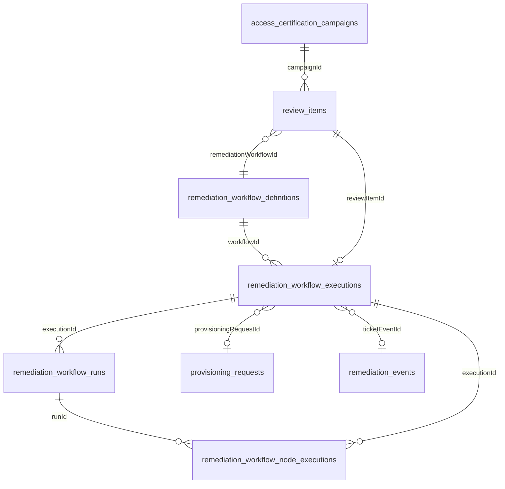
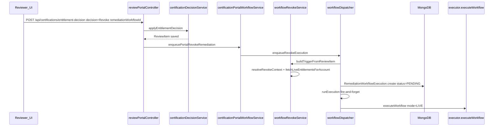
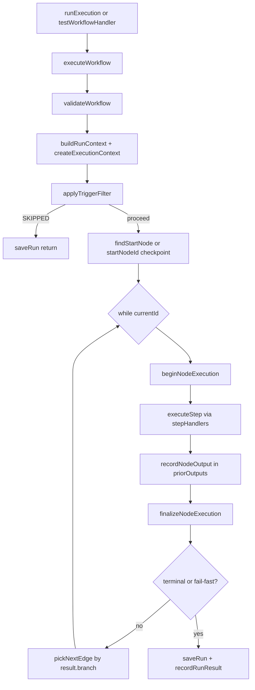
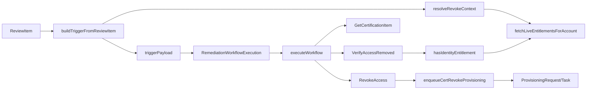
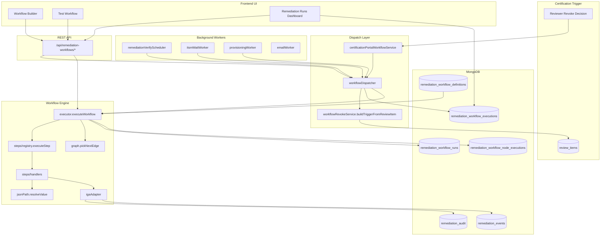

# Certification Remediation Workflow — Architecture Report

This document reverse-engineers the **current** Certification Remediation Workflow implementation. It describes existing behavior only — no recommendations or code changes.

**Codebase roots:**

- Backend engine: `Wisibility_IGA/icm-backend`
- Frontend UI: `Wisibility_IGA/icm-frontend`

**Important naming clarification:** The trigger type is `CertificationSignedOff`, but it fires when a **reviewer submits a Revoke decision** with a selected `remediationWorkflowId` — **not** when an executive signs off the campaign. Executive sign-off (`submitSignOff`) is audit-only and does not dispatch workflows.

**Two parallel remediation systems exist:**

1. **Active graph engine** — `remediation_workflow_*` collections + `src/workflows/engine/executor.js`
2. **Legacy batch queue** — `remediation_queue` / `remediation_events` via `ingestRevokeAccessFromCampaign` on campaign completion (separate from graph workflows)

---

## 1. Workflow Database Structure

### 1.1 Active certification remediation collections

#### `remediation_workflow_definitions`

| Attribute | Value |
|-----------|-------|
| **Collection name** | `remediation_workflow_definitions` |
| **Model file** | `icm-backend/src/models/workflow/RemediationWorkflowDefinition.js` |
| **Purpose** | Graph-native workflow definitions (nodes + edges + trigger metadata) |

**Schema:**

| Field | Type | Notes |
|-------|------|-------|
| `tenantId` | String | `null` = global template |
| `name` | String (required) | |
| `description` | String | |
| `version` | Number | default `1`; not a separate version collection |
| `enabled` | Boolean | default `true` |
| `trigger` | Object | `{ type: String, filter: Mixed }` — default type `CertificationSignedOff` |
| `nodes` | `[Mixed]` | Graph nodes (see node shape below) |
| `edges` | `[Mixed]` | Graph edges `{ from, to, branch? }` |
| `tags` | `[String]` | default `["CERTIFICATION_REVOKE"]` |
| `successCount` | Number | |
| `errorCount` | Number | |
| `createdBy` | String | |
| `createdAt`, `updatedAt` | Date | timestamps |

**Indexes:**

- Field-level: `tenantId`, `enabled`
- Compound: `{ tenantId: 1, enabled: 1, updatedAt: -1 }`
- Compound: `{ tenantId: 1, "trigger.type": 1, enabled: 1 }`

**Relationships:** Referenced by `remediation_workflow_executions.workflowId` (String `_id`)

**Node shape (embedded in `nodes[]`):**

```json
{
  "id": "verify",
  "type": "VerifyAccessRemoved",
  "label": "Verify Access Removed",
  "position": { "x": 150, "y": 320 },
  "config": {
    "identityId": "$.trigger.identityId",
    "entitlementName": "$.trigger.entitlementName"
  }
}
```

**Edge shape (embedded in `edges[]`):**

```json
{ "from": "stillPresent", "to": "emailIam", "branch": "true" }
```

**Workflow versions, nodes, connections, triggers, actions, operators, variables:** Not separate MongoDB collections. Nodes and edges are embedded Mixed arrays. Trigger/action/operator catalog types live in `icm-backend/src/workflows/catalog/workflow-catalog.json`. Only `CertificationSignedOff` trigger is implemented at runtime.

---

#### `remediation_workflow_executions`

| Attribute | Value |
|-----------|-------|
| **Collection name** | `remediation_workflow_executions` |
| **Model file** | `icm-backend/src/models/workflow/RemediationWorkflowExecution.js` |
| **Purpose** | One execution = one revoked entitlement routed through a workflow (remediation queue row) |

**Schema:**

| Field | Type | Notes |
|-------|------|-------|
| `tenantId` | String | |
| `executionId` | String (required, unique) | UUID business key |
| `eventType` | String | default `ACCESS_REVOKE` |
| `eventName` | String | |
| `workflowId` | String | → `remediation_workflow_definitions._id` |
| `workflowName` | String | denormalized |
| `campaignId`, `campaignName` | String | certification context |
| `reviewItemId` | String | → `review_items._id` |
| `entitlementName` | String | |
| `applicationId`, `applicationName` | String | |
| `identityId`, `identityName` | String | |
| `eventOwner` | String | |
| `status` | Enum | `PENDING`, `RUNNING`, `WAITING_ITSM`, `WAITING_VERIFICATION`, `COMPLETED`, `FAILED`, `SKIPPED` |
| `currentStepLabel` | String | |
| `stepStatuses` | `[String]` | UI status bullets |
| `waitReason` | Enum/null | `PROVISIONING`, `ITSM`, `VERIFICATION` |
| `checkpointNodeId` | String | resume point (typically `"verify"`) |
| `nextPollAt` | Date | scheduled re-verify |
| `pollIntervalMs` | Number | |
| `provisioningRequestId` | String | → `provisioning_requests._id` |
| `itsmTicketStatus` | String | denormalized |
| `failureReasonCode` | Enum/null | `REVOKE_FAILED`, `VERIFY_STILL_PRESENT`, `WORKFLOW_FAILURE`, `ENGINE_ERROR` |
| `failureReasonLabel`, `failureReasonDetail` | String | |
| `runId` | String | latest run |
| `runIds` | `[String]` | all runs (resume cycles) |
| `currentNodeId`, `currentNodeName` | String | |
| `durationMs` | Number | |
| `errorMessage`, `error` | String | |
| `ticketEventId` | String | → `remediation_events._id` |
| `triggerPayload` | Mixed | certification trigger snapshot |
| `startedAt`, `completedAt` | Date | |
| `createdAt`, `updatedAt` | Date | timestamps |

**Indexes:**

- Field-level: `tenantId`, `executionId` (unique), `eventType`, `workflowId`, `reviewItemId`, `status`, `nextPollAt`, `provisioningRequestId`, `runId`
- Compound: `{ tenantId: 1, status: 1, createdAt: -1 }`
- Compound: `{ tenantId: 1, reviewItemId: 1 }`

**Relationships:** → definitions, → `review_items`, → runs, → `provisioning_requests`, → `remediation_events`

---

#### `remediation_workflow_runs`

| Attribute | Value |
|-----------|-------|
| **Collection name** | `remediation_workflow_runs` |
| **Model file** | `icm-backend/src/models/workflow/RemediationWorkflowRun.js` |
| **Purpose** | Run history / trace of one graph walk (TEST or LIVE) |

**Schema:**

| Field | Type | Notes |
|-------|------|-------|
| `tenantId` | String | |
| `runId` | String (required, unique) | UUID |
| `workflowId` | String | |
| `executionId` | String | parent execution (null for standalone TEST) |
| `status` | Enum | `SUCCESS`, `FAILED`, `SKIPPED` |
| `mode` | Enum | `TEST`, `LIVE` |
| `trigger` | Mixed | trigger input |
| `steps` | `[Mixed]` | embedded step trace |
| `outputs` | Mixed | all node outputs keyed by node id |
| `sideEffects` | Mixed | emails, tickets, provisioning IDs |
| `skipReason` | String | |
| `validationErrors` | `[String]` | |
| `error` | String | |
| `startedAt`, `completedAt` | Date | |
| `durationMs` | Number | |
| `createdAt`, `updatedAt` | Date | timestamps |

**Embedded `steps[]` element (written by executor):**

```
{ stepId, type, label, status, branch, input, output, startedAt, completedAt, executionTime, error, stackTrace }
```

**Indexes:**

- Field-level: `tenantId`, `runId` (unique), `workflowId`, `executionId`, `status`, `mode`
- Compound: `{ tenantId: 1, workflowId: 1, startedAt: -1 }`

**Relationships:** Parent = execution (optional for TEST); child = node executions

---

#### `remediation_workflow_node_executions`

| Attribute | Value |
|-----------|-------|
| **Collection name** | `remediation_workflow_node_executions` |
| **Model file** | `icm-backend/src/models/workflow/RemediationWorkflowNodeExecution.js` |
| **Purpose** | Per-node execution records (supports retries/resume via `attemptNumber`) |

**Schema:**

| Field | Type | Notes |
|-------|------|-------|
| `tenantId` | String | |
| `nodeExecutionId` | String (required, unique) | UUID |
| `executionId` | String | parent execution |
| `runId` | String (required) | parent run |
| `workflowId` | String | |
| `attemptNumber` | Number | default `1` |
| `nodeId` | String (required) | graph node id |
| `nodeName` | String | |
| `nodeType` | String | e.g. `RevokeAccess`, `CompareStrings` |
| `status` | Enum | `PENDING`, `RUNNING`, `SUCCESS`, `FAILED`, `SKIPPED` |
| `branch` | String | `true`/`false` for operators |
| `input`, `output` | Mixed | |
| `errorMessage`, `stackTrace` | String | |
| `retryCount` | Number | |
| `startedAt`, `completedAt` | Date | |
| `durationMs` | Number | |
| `createdAt`, `updatedAt` | Date | timestamps |

**Indexes:**

- Field-level: `tenantId`, `nodeExecutionId` (unique), `executionId`, `runId`, `workflowId`, `nodeId`, `nodeType`, `status`
- Compound: `{ executionId: 1, nodeId: 1, attemptNumber: 1 }`
- Compound: `{ executionId: 1, startedAt: 1 }`
- Compound: `{ runId: 1, startedAt: 1 }`

**Relationships:** → execution, → run

---

### 1.2 Certification event mapping (embedded, not a collection)

**Collection:** `review_items`  
**Model file:** `icm-backend/src/models/certification/ReviewItem.js`

| Field | Level | Purpose |
|-------|-------|---------|
| `remediationWorkflowId` | item + per-entitlement | Selected workflow definition `_id` |
| `remediationExecutionId` | item + per-entitlement | Active execution UUID |
| `remediationStatus` | item + per-entitlement | Denormalized execution status |
| `provisioningStatus` | per-entitlement | `PENDING` / `EXECUTED` / `FAILED` |

Synced by `syncReviewItemStatus()` in `icm-backend/src/services/workflow/workflowDispatcher.js`.

---

### 1.3 Legacy / adjacent collections

| Collection | Model file | Role |
|------------|------------|------|
| `workflow_definitions` | `models/provisioning/WorkflowDefinition.js` | Legacy linear `steps[]` — no active service imports |
| `workflow_instances` | `models/provisioning/WorkflowInstance.js` | Legacy runtime instances |
| `approval_workflows` | `models/access/ApprovalWorkflow.js` | Multi-stage approval routing (unrelated) |
| `remediation_events` | `models/remediation/RemediationEvent.js` | ITSM tickets; `workflowState` enum; linked via `ticketEventId` |
| `remediation_queue` | `models/remediation/RemediationQueue.js` | Legacy batch ingest on campaign completion |
| `remediation_audit` | `models/remediation/RemediationAuditLog.js` | Audit entries from `AuditLog` step via IGA adapter |
| `remediation_execution_logs` | `models/remediation/RemediationExecutionLog.js` | Legacy remediation pipeline logs |
| `remediation_tickets` | `models/remediation/RemediationTicket.js` | Legacy ticket model |
| `remediation_notifications` | `models/remediation/RemediationNotification.js` | Legacy notifications |

**Collections that do NOT exist:** `workflowDefinitions`, `workflowExecutions`, `workflowRunHistory`, `workflowEvents`, separate `workflow_nodes`, `workflow_connections`, or `workflow_variables` collections.

---

### 1.4 Persistence layer files

| File | Role |
|------|------|
| `src/workflows/persistence/workflowStore.js` | CRUD for `remediation_workflow_definitions` |
| `src/workflows/persistence/runStore.js` | Upsert/list for `remediation_workflow_runs` |
| `src/workflows/persistence/nodeExecutionStore.js` | CRUD for `remediation_workflow_node_executions` |
| `src/services/workflow/workflowDispatcher.js` | Creates/runs `remediation_workflow_executions` |
| `src/workflows/catalog/workflow-catalog.json` | Trigger/action/operator catalog (not MongoDB) |

---

### 1.5 ER diagram



---

## 2. Certification Event Flow

### 2.1 Lifecycle: Reviewer Revoke → Workflow Execution Start

The `CertificationSignedOff` trigger does **not** originate from executive campaign sign-off. It originates from reviewer revoke decisions.

| Entry | Controller | Service chain |
|-------|-----------|---------------|
| Portal revoke | `controllers/reviewPortalController.js` — `postEntitlementDecision`, `postReviewDecision`, `postBulkEntitlementDecision` | `certificationDecisionService.applyEntitlementDecision` → `certificationPortalWorkflowService.enqueuePortalRevokeRemediation` → `enqueueRevokeExecution` |
| Console revoke | `controllers/access-certification/reviewerController.js` — `updateCampaignReview`, `applyEntitlementDecisionHandler` | `enqueueItemLevelRemediations` → `enqueueRevokeExecution` |
| Executive sign-off | `controllers/access-certification/certificationSignOffController.js` — `submitSignOff` | **No workflow dispatch** — updates `CertificationSignOff` + `CertificationReport` only |
| Legacy batch (parallel) | `certificationDecisionService.updateCampaignProgress` | `remediationQueueIngestionService.ingestRevokeAccessFromCampaign` → `remediation_queue` (not graph engine) |

**Frontend workflow picker:** `icm-frontend/src/pages/governance/accessCertification/ReviewDecisionModal.jsx` loads `GET /remediation-workflows/workflows/enabled?trigger=CertificationSignedOff`.

### 2.2 Sequence diagram



### 2.3 Event publishers / consumers

There is **no message bus** (no RabbitMQ/Kafka/Redis pub-sub). The "event" is an in-memory trigger object passed to `executeWorkflow`. Dispatch uses a fire-and-forget async call:

```javascript
// workflowDispatcher.js
runExecution(executionId).catch((err) =>
  console.error("[workflowDispatcher] runExecution failed:", err.message),
);
```

### 2.4 Background workers (MongoDB poll loops)

Started in `icm-backend/src/server.js`:

| Worker | File | Resumes execution when |
|--------|------|------------------------|
| `startRemediationVerifyScheduler` | `services/workflow/remediationVerifyScheduler.js` | `status: WAITING_ITSM`, `nextPollAt <= now` → `runExecution(id, { resume: "verify" })` |
| `startItsmWaitWorker` | `services/workflow/itsmWaitWorker.js` | ITSM ticket closed → `runExecution(id, { resume: "itsm_closed" })` |
| `startProvisioningWorker` | `services/provisioning/provisioningWorker.js` | Provisioning task complete → `runExecution(id, { resume: "verify" })` |
| `startEmailWorker` | `services/email/emailWorkerService.js` | Delivers `EmailJob` rows queued by `SendEmail` step |
| `startRemediationQueueScheduler` | `jobs/remediationQueueScheduler.js` | Legacy `RemediationQueue` ingestion (not graph workflow) |

### 2.5 Trigger payload shape

Built by `buildTriggerFromReviewItem` in `services/workflow/workflowRevokeService.js`:

```javascript
{
  decision: "Revoke",
  identityId, identityName, identityEmail,
  managerEmail, managerName,
  applicationId, applicationName,
  entitlementId, entitlementName,
  campaignId, campaignName,
  reviewItemId,
  provisioningAction,
  nativeIdentity,
  // transient on ITSM resume:
  escalateOnStillPresent: true  // only when resume === "itsm_closed"
}
```

---

## 3. Workflow Execution Engine

The engine is **functional/module-based** — there is no `WorkflowExecutor` class.

### 3.1 Component map

| Role | File | Function / export |
|------|------|-------------------|
| Main executor | `workflows/engine/executor.js` | `executeWorkflow(definition, triggerInput, options)` |
| Live orchestrator | `services/workflow/workflowDispatcher.js` | `enqueueRevokeExecution`, `runExecution` |
| Step dispatcher | `workflows/steps/registry.js` | `executeStep(node, context, priorOutputs)` |
| Step handlers | `workflows/steps/handlers.js` | `stepHandlers` map keyed by `node.type` |
| Handler registration | `workflows/steps/index.js` | `ensureStepsRegistered()` |
| Graph router | `workflows/engine/graph.js` | `findStartNode`, `pickNextEdge`, `collectDownstreamNodes`, `isTerminalType` |
| Trigger filter | `workflows/engine/triggerFilter.js` | `applyTriggerFilter` |
| Execution context | `workflows/engine/executionContext.js` | `createExecutionContext`, `setCurrentNode`, `recordNodeOutput` |
| Run context | `workflows/steps/context.js` | `buildRunContext`, `normalizeTrigger` |
| Variable resolver | `workflows/workflow/jsonPath.js` | `resolveValue`, `resolveObject`, `renderTemplate`, `buildContext` |
| Definition validation | `workflows/workflow/validator.js` | `validateWorkflow` |
| Definition repair | `workflows/workflow/repairDefinition.js` | `repairWorkflowDefinition` |
| Live side effects | `workflows/adapters/igaAdapter.js` | `createIgaAdapter` |
| Test side effects | `workflows/adapters/demoAdapter.js` | `createDemoAdapter` |
| Test API | `controllers/remediationWorkflowController.js` | `testWorkflowHandler`, `testDefinitionHandler` |

### 3.2 Execution flow



**Main loop** (`executor.js`):

1. `validateWorkflow(definition)` — early return `FAILED` if invalid
2. `buildRunContext(triggerInput, options)` — adapter + config
3. `applyTriggerFilter(definition, context.trigger)` — skip run if decision mismatch
4. `findStartNode(nodes)` or `startNodeId` for resume checkpoint
5. While `currentId` and `stepCount < MAX_STEPS` (50):
   - Cycle detection via `visited` set
   - `beginNodeExecution` (optional persistence)
   - `executeStep(node, context, priorOutputs)` with try/catch
   - `recordNodeOutput` → `priorOutputs[node.id] = output`
   - `finalizeNodeExecution` → complete/fail/skip node record
   - Fail-fast check (TEST default)
   - Terminal node check (`EndSuccess`, `EndFailure`, `EndWaiting`)
   - `pickNextEdge(edges, currentId, result.branch)` → next node
6. `saveRun` + `recordRunResult` (unless `WAITING`)

**Resume behavior:** `runExecution` passes `startNodeId: execution.checkpointNodeId || "verify"` when `resume` is `"verify"` or `"itsm_closed"`. Each resume creates a **new run** appended to `execution.runIds[]`.

**Mode differences:**

| Option | TEST (default) | LIVE |
|--------|----------------|------|
| `mode` | `"TEST"` | `"LIVE"` |
| `failFast` | `true` (default) | `false` (default) |
| `adapter` | `createDemoAdapter()` | `createIgaAdapter()` |
| `executionId` | usually null | set on execution row |
| `persist` | true when workflow has id | always true |

---

## 4. Node Types

All runtime handlers: `icm-backend/src/workflows/steps/handlers.js`  
Catalog definitions: `icm-backend/src/workflows/catalog/workflow-catalog.json`  
Reference workflow template: `icm-backend/src/workflows/templates/cert-revoke-flow.json`

### 4.1 Implemented node types

| Node Type | Category | Purpose | Input (config) | Output | Branch | Source |
|-----------|----------|---------|----------------|--------|--------|--------|
| `CertificationSignedOff` | trigger | Entry point | `filterDecision` | Full trigger payload | null | `handlers.js` lines 15–24 |
| `GetCertificationItem` | action | Load identity context | — | `{ reviewItem, identity }` | null | `handlers.js` lines 27–51 |
| `CompareStrings` | operator | Boolean branch | `left`, `right` (JSONPath) | `{ left, right, match }` | `"true"` / `"false"` | `handlers.js` lines 54–74 |
| `VerifyDataType` | operator | Field exists/null | `field`, `check` | `{ field, check, match }` | `"true"` / `"false"` | `handlers.js` lines 77–91 |
| `VerifyAccessRemoved` | action | Live entitlement check | `identityId`, `entitlementId`, `entitlementName` | `{ stillPresent, verified, portalLink }` | `"true"` if still present | `handlers.js` lines 128–164 |
| `RevokeAccess` | action | Queue provisioning revoke | identity/entitlement JSONPaths | `{ success, provisioningRequestId, ... }` | null | `handlers.js` lines 94–125 |
| `SendEmail` | action | Notify user/manager/IAM | `to`, `from`, `subject`, `body` | `{ emailJobId, queued, ... }` | null | `handlers.js` lines 167–211 |
| `CreateTicket` | action | ITSM ticket | `title`, `priority`, `assignee`, `description` | `{ ticketId, ... }` | null | `handlers.js` lines 214–246 |
| `AuditLog` | action | Governance evidence | `action`, `outcome`, `message` | `{ auditId, ... }` | null | `handlers.js` lines 249–275 |
| `EndSuccess` | operator | Terminal success | — | `{ ended: true, status: "SUCCESS" }` | null | `handlers.js` lines 278–287 |
| `EndFailure` | operator | Terminal failure | — | `{ ended: true, status: "FAILURE" }` | null | `handlers.js` lines 290–298 |
| `EndWaiting` | operator | Park execution | — | `{ ended: true, status: "WAITING" }` | null | `handlers.js` lines 302–311 |
| `CatalogStub` | action | Design-only ISC steps | `catalogLabel` | `{ designOnly: true }` | null | `handlers.js` lines 314–328 |

### 4.2 User-facing actions in reference workflow

The example workflow actions map to node types as follows:

| User label | Node id (template) | Type | Config highlight |
|------------|-------------------|------|------------------|
| Certification Signed Off | `trigger` | `CertificationSignedOff` | `filterDecision: "Revoke"` |
| Get Certification Item | `getItem` | `GetCertificationItem` | — |
| Verify Access Removed | `verify` | `VerifyAccessRemoved` | JSONPath identity/entitlement |
| Access Still Present? | `stillPresent` | `CompareStrings` | `left: "$.steps.verify.stillPresent"`, `right: "true"` |
| Notify IAM Team | `emailIam` | `SendEmail` | `to: "{{$.config.iamTeamEmail}}"` |
| Notify User | `emailUser` | `SendEmail` | `to: "$.trigger.identityEmail"` |
| Notify Manager | `emailManager` | `SendEmail` | `to: "$.trigger.managerEmail"` |
| Revoke Access | `revokeAccess` | `RevokeAccess` | queues provisioning |
| Create ITSM Ticket | `createTicket` | `CreateTicket` | → `RemediationEvent` |
| End Success / Failure / Waiting | `endSuccess`, `endFailure`, `endWaiting` | terminal operators | — |

### 4.3 Unregistered handler behavior

If `node.type` has no handler in the registry, `registry.js` returns:

```javascript
{
  status: "SUCCESS",
  output: { skipped: true, reason: "No handler registered" },
  branch: null,
}
```

### 4.4 IGA adapter side effects

`workflows/adapters/igaAdapter.js` — `createIgaAdapter`:

| Method | Delegates to |
|--------|--------------|
| `getIdentity` | Identity lookup |
| `hasEntitlement` | `hasIdentityEntitlement` in `workflowRevokeService.js` |
| `revokeEntitlement` | `enqueueCertRevokeProvisioning` in `certRevokeProvisioningService.js` |
| `addEmail` | `enqueueWorkflowEmail` in `workflowEmailService.js` → `EmailJob` |
| `addTicket` | Creates `RemediationEvent`, notifies ITSM assignee |
| `addAudit` | Creates `RemediationAuditLog` |

---

## 5. Workflow Context Model

### 5.1 Two context layers

**Engine context** (`workflows/engine/executionContext.js`):

```javascript
{
  executionId, workflowId, runId,
  triggerPayload,
  nodeOutputs: {},   // keyed by node id
  variables: {},     // defined but not populated by handlers today
  currentNode: null
}
```

**Step resolution context** (`workflows/workflow/jsonPath.js` — `buildContext`):

```javascript
{
  trigger: {
    decision, identityId, identityName, identityEmail,
    managerEmail, managerName,
    entitlementId, entitlementName,
    applicationId, applicationName,
    campaignId, campaignName, reviewItemId,
    nativeIdentity, escalateOnStillPresent
  },
  steps: {
    verify: { stillPresent, verified, portalLink },
    getItem: { identity, reviewItem },
    // ... keyed by node id from priorOutputs
  },
  config: {
    portalBaseUrl, iamTeamEmail, workflowFromEmail, ...
  }
}
```

Handlers call `stepContext(context, priorOutputs)` which invokes `buildContext(trigger, priorOutputs, config)`.

### 5.2 Data flow between nodes

```
Trigger Output (CertificationSignedOff)
  → priorOutputs["trigger"] = trigger fields
Get Certification Item (id: getItem)
  → priorOutputs["getItem"] = { reviewItem, identity }
Verify Access Removed (id: verify)
  → priorOutputs["verify"] = { stillPresent, verified, portalLink }
CompareStrings (id: stillPresent)
  → reads $.steps.verify.stillPresent
  → branch "true" or "false"
```

### 5.3 Example JSONPath expressions

| Expression | Resolves to |
|------------|-------------|
| `$.trigger.decision` | `"Revoke"` |
| `$.trigger.identityName` | Review item name |
| `$.steps.verify.stillPresent` | Boolean from verify step |
| `$.steps.verify.portalLink` | Identity portal URL |
| `$.config.iamTeamEmail` | IAM team email from env/config |
| `{{$.trigger.identityName}}` | Template interpolation via `renderTemplate` |

**Important:** Paths use **node id** as the `steps` key (`verify`, `getItem`), not the node type. `$.steps.getCertificationItem` only works if the node id is literally `getCertificationItem`; the enterprise template uses id `getItem`.

### 5.4 Runtime variables

`execContext.variables` exists in `executionContext.js` but no handler writes to it. All inter-step data flows through `nodeOutputs` / `priorOutputs` / `steps`.

---

## 6. Condition Evaluation

### 6.1 Evaluation locations

1. **Operator handlers** — return `branch: "true" | "false"` (`CompareStrings`, `VerifyDataType`)
2. **Branching action** — `VerifyAccessRemoved` sets `branch` from `stillPresent`
3. **Graph routing** — `pickNextEdge(edges, fromId, branch)` in `graph.js`
4. **Pre-run filter** — `applyTriggerFilter` skips entire run (not graph branching)

### 6.2 CompareStrings logic

```javascript
// handlers.js — CompareStrings
const left = resolveValue(node.config?.left ?? "$.trigger.decision", stepCtx);
const right = resolveValue(node.config?.right ?? "Revoke", stepCtx);
const boolCompare = typeof left === "boolean" || typeof right === "boolean"
  || right === "true" || right === "false";
const match = boolCompare
  ? String(left) === String(right)
  : String(left).toLowerCase() === String(right).toLowerCase();
return { branch: match ? "true" : "false", ... };
```

### 6.3 "Access Still Present?" example

Node `stillPresent` in `cert-revoke-flow.json`:

```json
{ "left": "$.steps.verify.stillPresent", "right": "true" }
```

**Code path:**

1. `executeStep` → `CompareStrings.execute`
2. `resolveValue("$.steps.verify.stillPresent", stepCtx)` → boolean
3. `match = String(left) === String(right)` (boolean compare mode)
4. `branch = match ? "true" : "false"`
5. `pickNextEdge(edges, "stillPresent", branch)` selects edge with matching `branch` field
6. `"true"` → `escalate` node; `"false"` → `emailUser` (access removed path)

### 6.4 pickNextEdge logic

```javascript
// graph.js
export function pickNextEdge(edges, fromId, branch) {
  const outEdges = edges.filter((e) => e.from === fromId);
  if (!outEdges.length) return null;
  if (branch != null) {
    const match = outEdges.find((e) => e.branch === branch) || ...;
    if (match) return match;
  }
  if (outEdges.length === 1) return outEdges[0];
  return outEdges.find((e) => !e.branch) || outEdges[0];
}
```

### 6.5 Trigger filter (pre-graph)

```javascript
// triggerFilter.js
const filterDecision = triggerNode?.config?.filterDecision || definition?.trigger?.filter?.decision;
if (decision !== expected) return { proceed: false, reason: "..." };
```

### 6.6 Supported vs catalog-only operators

| Operator | Status |
|----------|--------|
| `CompareStrings` | Implemented |
| `VerifyDataType` | Implemented |
| `VerifyAccessRemoved` | Implemented (action with implicit branch) |
| Compare Numbers | Catalog stub only |
| Compare Timestamps | Catalog stub only |
| Loop | Catalog stub only |

---

## 7. Execution Persistence

The system stores **three persistence layers**:

### 7.1 Layer 1 — Execution row (business queue)

**Collection:** `remediation_workflow_executions`

Run-level status + certification context + denormalized `stepStatuses[]` bullets. **No per-step input/output** on this collection.

Created by `enqueueRevokeExecution`; updated by `runExecution` and `onNodeProgress` callback.

### 7.2 Layer 2 — Run trace

**Collection:** `remediation_workflow_runs`

Full graph walk with embedded `steps[]` containing per-step `input`, `output`, `error`, `stackTrace`.

Written by `saveRun()` in `workflows/persistence/runStore.js` at end of `executeWorkflow`.

### 7.3 Layer 3 — Node executions

**Collection:** `remediation_workflow_node_executions`

Granular per-node records with `attemptNumber` for resume cycles. `getNextAttemptNumber(executionId, nodeId)` increments on re-runs of the same node.

Written during execution when `shouldTrackNodes()` is true (always when `runId` is set).

### 7.4 What is stored — summary

| Data | Execution row | Run | Node execution |
|------|---------------|-----|----------------|
| `workflowId`, `status` | yes | yes | yes |
| Certification context | yes | trigger only | no |
| Step `input` / `output` | no | yes (embedded) | yes |
| Step `error` / `stackTrace` | no | yes | yes |
| `sideEffects` (emails, tickets) | pointers only | yes | no |
| `attemptNumber` / `retryCount` | no | no | yes |

**Answer:** Both run-level AND step-level execution are stored.

### 7.5 UI resolution order for step timeline

Frontend resolves steps in this priority (`resolveExecutionSteps`):

1. `nodeTimeline` (from node executions API)
2. `run.executionSteps` (formatted embedded steps)
3. `run.steps` (raw embedded steps)

---

## 8. Failure Handling

### 8.1 Exception handling in executor

All step execution is wrapped in try/catch (`executor.js`):

```javascript
try {
  result = await executeStep(node, context, priorOutputs);
} catch (err) {
  caughtError = err;
  result = {
    status: "FAILED",
    input: { node: { id: node.id, type: node.type } },
    output: { error: err?.message || "Step execution failed", stackTrace: err?.stack },
    branch: null,
  };
}
```

Stored via:
- Embedded `steps[]` on run (`error`, `stackTrace`)
- `failNodeExecution(nodeExecutionId, { errorMessage, stackTrace, ... })`
- Dispatcher updates execution `error`, `failureReasonCode/Label/Detail`

### 8.2 Fail-fast behavior

```javascript
function isFailFastStepFailure(result, node, failFast) {
  if (!failFast || result.status !== "FAILED") return false;
  if (node.type === "VerifyAccessRemoved") return false;
  return true;
}
```

| Mode | failFast default | On step FAILED |
|------|------------------|----------------|
| TEST | `true` | Stop loop; mark downstream SKIPPED |
| LIVE | `false` | Set `finalStatus = FAILED` but loop may continue to next edge |

Downstream skip uses `appendSkippedDownstream` + `persistSkippedNodes` with reason `"Workflow stopped due to upstream step failure"`.

### 8.3 Scenario: VerifyAccessRemoved throws exception

1. Caught in executor try/catch → `status: "FAILED"`
2. Stored in run steps + node execution
3. **Fail-fast does NOT apply** to `VerifyAccessRemoved` — graph continues to next edge
4. If no matching edge, loop ends with `finalStatus = FAILED`

### 8.4 Scenario: RevokeAccess returns failure

1. Handler returns `status: "FAILED"` (provisioning enqueue failed)
2. LIVE: `finalStatus = FAILED`; graph may continue unless terminal reached
3. Dispatcher: `deriveFailureReason(run)` → `REVOKE_FAILED`
4. Execution → `status: FAILED`; `syncReviewItemStatus` → `provisioningStatus: FAILED`

### 8.5 Scenario: Access still present (happy-path branch, not failure)

1. `VerifyAccessRemoved` → `status: "SUCCESS"`, `branch: "true"`
2. Graph: `stillPresent` → `escalate` → `revokeAccess` → `createTicket` → `endWaiting`
3. Dispatcher: `status: WAITING_ITSM`, `checkpointNodeId: "verify"`, `nextPollAt` scheduled
4. Workers resume; after ITSM close with still-present access:
   - `escalateOnStillPresent: true` on trigger
   - `escalate` node branches to `emailIam` → `auditFailure` → `endFailure`
   - `deriveFailureReason` → `VERIFY_STILL_PRESENT`

### 8.6 Failure reason classification

`deriveFailureReason(run)` in `workflowDispatcher.js`:

| Code | Condition |
|------|-----------|
| `REVOKE_FAILED` | `RevokeAccess` step status FAILED |
| `VERIFY_STILL_PRESENT` | `VerifyAccessRemoved` output `stillPresent === true` at terminal failure |
| `WORKFLOW_FAILURE` | Reached `EndFailure` node |
| `ENGINE_ERROR` | Other failures |

### 8.7 Branch execution on failure

- **TEST + fail-fast:** downstream nodes are SKIPPED, not executed
- **LIVE:** downstream may still execute unless terminal node reached or cycle/max steps
- **VerifyAccessRemoved:** always continues branching regardless of fail-fast

---

## 9. Execution History UI

**API base:** `/api/remediation-workflows`  
**Routes file:** `icm-backend/src/routes/remediationWorkflowRoutes.js`  
**Controller:** `icm-backend/src/controllers/remediationWorkflowController.js`

### 9.1 Page mapping

| UI surface | Frontend route | Component | API endpoints | Collections queried |
|------------|---------------|-----------|---------------|---------------------|
| **Remediation Runs** (Workflow Runs) | `/governance/remediation-runs` | `RemediationRunsDashboard.jsx`, `RemediationEventTypePage.jsx` | `GET /executions`, `GET /executions/:executionId` | `remediation_workflow_executions`, `remediation_workflow_runs`, `remediation_workflow_node_executions` |
| **Workflow Details** (Builder) | `/governance/workflows/:id/edit` | `WorkflowBuilder.jsx` | `GET/PUT /workflows/:id`, `POST /workflows/:id/validate`, `GET /catalog` | `remediation_workflow_definitions` |
| **Test Workflow** | `/governance/workflows/:id/test` | `WorkflowTest.jsx`, `TestWorkflowModal.jsx` | `POST /workflows/:id/test`, `GET /samples/triggers` | `remediation_workflow_runs`, `remediation_workflow_node_executions` |
| **Run History** (Execution History) | Embedded in test page | `RunHistoryPanel.jsx` | `GET /workflows/:id/runs`, `GET /runs/:runId` | `remediation_workflow_runs`, `remediation_workflow_node_executions` |

**Shared debugger:** `TestExecutionDebugger.jsx` — step timeline used by test runs, run history, and live execution detail.

**Legacy redirect:** `/governance/workflows/executions` → `/governance/remediation-runs`

### 9.2 API response shapes

**`GET /executions`** → `{ success: true, data: ExecutionDoc[] }`

Lean `RemediationWorkflowExecution` documents with `executionId`, `status`, `stepStatuses`, `workflowName`, certification fields, etc.

**`GET /executions/:executionId`** → `{ success: true, data: { execution, run, nodeExecutions, nodeTimeline } }`

- `execution` — formatted via `executionFormat.js` (`formatWorkflowExecution`)
- `run` — formatted via `testRunFormat.js` or null
- `nodeExecutions` — array of node execution docs
- `nodeTimeline` — normalized steps for debugger UI

**`POST /workflows/:id/test`** → immediate test result with `steps[]`, `executionSteps[]`, `sideEffects`, `executionContext`

**`GET /workflows/:id/runs`** → `{ success: true, data: [{ runId, status, mode, stepCount, durationMs, ... }] }`

**`GET /runs/:runId`** → formatted run with merged node timeline

### 9.3 Full API route index

| Method | Route | Handler |
|--------|-------|---------|
| GET | `/catalog` | `getCatalog` |
| GET | `/catalog/step-config` | `getStepConfig` |
| GET | `/template/cert-revoke` | `getTemplate` |
| GET | `/samples/triggers` | `getSampleTriggers` |
| GET | `/runs/:runId` | `getRun` |
| GET | `/executions` | `listExecutions` |
| GET | `/executions/:executionId` | `getExecution` |
| GET | `/executions/:executionId/nodes` | `getExecutionNodes` |
| GET | `/workflows/enabled` | `listEnabledWorkflows` |
| GET | `/workflows` | `listWorkflows` |
| POST | `/workflows` | `createWorkflowHandler` |
| GET | `/workflows/:id` | `getWorkflow` |
| PUT | `/workflows/:id` | `updateWorkflowHandler` |
| DELETE | `/workflows/:id` | `deleteWorkflowHandler` |
| GET | `/workflows/:id/runs` | `getWorkflowRuns` |
| POST | `/workflows/:id/validate` | `validateWorkflowHandler` |
| POST | `/workflows/:id/test` | `testWorkflowHandler` |
| POST | `/workflows/test-definition` | `testDefinitionHandler` |
| POST | `/workflows/seed-template` | `seedTemplateHandler` |

---

## 10. Certification Remediation Architecture

### 10.1 Data connection diagram



### 10.2 Concern mapping

| Concern | Implementation |
|---------|----------------|
| Certification item lookup | `resolveRevokeContext` reads `ReviewItem.entitlementDecisions[]`, `provisioningPayload`, `entitlementSnapshot` (`workflowRevokeService.js`) |
| Campaign lookup | `campaignId` / `campaignName` from review item + API context |
| Reviewer lookup | `eventOwner` stored on execution; not used in step logic |
| Access verification | `fetchLiveEntitlementsForAccount` (same source as Identity Accounts tab) → `hasIdentityEntitlement` |
| Access remediation | `RevokeAccess` → `enqueueCertRevokeProvisioning` → provisioning worker (does not mutate IGA state directly) |
| Workflow selection | UI: `GET /workflows/enabled?trigger=CertificationSignedOff`; reviewer picks `remediationWorkflowId` at decision time |
| ITSM escalation | `CreateTicket` → `RemediationEvent`; `itsmWaitWorker` watches ticket closure |
| Scheduled re-verify | `remediationVerifyScheduler` polls `nextPollAt` on `WAITING_ITSM` executions |
| Idempotency | Side-effecting steps keyed by `executionId` — resume does not duplicate provisioning or tickets |

### 10.3 Reference workflow graph (cert-revoke-flow.json)

```
Certification Signed Off (trigger)
  → Decision = Revoke? (CompareStrings)
    → false → End (No Revoke)
    → true → Get Certification Item
      → Verify Access Removed
        → Access Still Present? (CompareStrings)
          → false → Notify User → Notify Manager → Audit Success → End Success
          → true → Escalate? (CompareStrings)
            → false → Revoke Access → Create Ticket → End Waiting
            → true → Notify IAM → Audit Failure → End Failure
```

### 10.4 Legacy parallel path

When campaign reaches 100% completion:

```
updateCampaignProgress → ingestRevokeAccessFromCampaign → RemediationQueue / RemediationEvent
```

This path does **not** use the graph workflow engine or `remediation_workflow_executions`.

---

## 11. Current Gaps (Capability Matrix)

| Capability | Status | Evidence |
|------------|--------|----------|
| Workflow execution history | **SUPPORTED** | `remediation_workflow_executions` + Remediation Runs UI |
| Step execution history | **SUPPORTED** | `remediation_workflow_runs.steps[]` + `remediation_workflow_node_executions` |
| Input/output tracking per step | **SUPPORTED** | `input`/`output` on run steps and node executions |
| Error tracking per step | **SUPPORTED** | `error`, `errorMessage`, `stackTrace` fields |
| Execution timeline | **SUPPORTED** | `TestExecutionDebugger` + `nodeTimeline` from `GET /executions/:id` |
| Retry failed step | **NOT SUPPORTED** | `attemptNumber` increments only on checkpoint resume; no API/UI to retry arbitrary failed step |
| Resume from failed step | **PARTIALLY SUPPORTED** | Resume only from `checkpointNodeId` (`verify`) via schedulers — not from arbitrary failed node |
| Audit trail | **SUPPORTED** | `AuditLog` step → `remediation_audit`; separate `CampaignAuditLog` for notifications |
| Test workflow execution | **SUPPORTED** | `POST /workflows/:id/test` with `demoAdapter`, `mode: TEST`, fail-fast enabled |

**Additional architectural gaps:**

- `variables` on execution context is unused by handlers
- No `workflowEvents` collection or event bus
- Executive campaign sign-off does not trigger graph workflows
- Legacy `remediation_queue` batch path runs in parallel
- Most ISC catalog triggers/actions/operators are design-only (`CatalogStub` or unregistered)
- `GET /executions/:executionId/nodes` exists but is not used by current UI

---

## 12. Final Architecture Map



### 12.1 Key file index

| Area | Path |
|------|------|
| Models | `icm-backend/src/models/workflow/*.js` |
| Engine | `icm-backend/src/workflows/engine/*.js` |
| Steps | `icm-backend/src/workflows/steps/*.js` |
| Persistence | `icm-backend/src/workflows/persistence/*.js` |
| Catalog | `icm-backend/src/workflows/catalog/workflow-catalog.json` |
| Templates | `icm-backend/src/workflows/templates/cert-revoke-flow.json` |
| Dispatch | `icm-backend/src/services/workflow/workflowDispatcher.js` |
| Revoke context | `icm-backend/src/services/workflow/workflowRevokeService.js` |
| Portal enqueue | `icm-backend/src/services/workflow/certificationPortalWorkflowService.js` |
| Provisioning | `icm-backend/src/services/workflow/certRevokeProvisioningService.js` |
| API controller | `icm-backend/src/controllers/remediationWorkflowController.js` |
| API routes | `icm-backend/src/routes/remediationWorkflowRoutes.js` |
| Portal controller | `icm-backend/src/controllers/reviewPortalController.js` |
| Decision service | `icm-backend/src/services/access-certification/certificationDecisionService.js` |
| Frontend workflows | `icm-frontend/src/features/workflows/` |
| Frontend runs | `icm-frontend/src/features/remediation-runs/` |
| Server startup | `icm-backend/src/server.js` |

### 12.2 Name mapping (common search terms → actual code)

| Search term | Actual implementation |
|-------------|----------------------|
| `WorkflowExecutor` | `executeWorkflow` in `executor.js` |
| `NodeRunner` / `StepExecutor` | `executeStep` in `registry.js` + `stepHandlers` in `handlers.js` |
| `BranchEvaluator` / `ConditionEvaluator` | Operator handlers + `pickNextEdge` in `graph.js` + `applyTriggerFilter` |
| `WorkflowContext` | `createExecutionContext` + `buildRunContext` + `buildContext` (jsonPath) |
| `workflowExecutions` collection | `remediation_workflow_executions` |
| `workflowRunHistory` collection | `remediation_workflow_runs` + `remediation_workflow_node_executions` |
| `workflowEvents` collection | Does not exist |

---

*Document generated from reverse-engineering of the Wisibility_IGA codebase. Describes current behavior only.*
