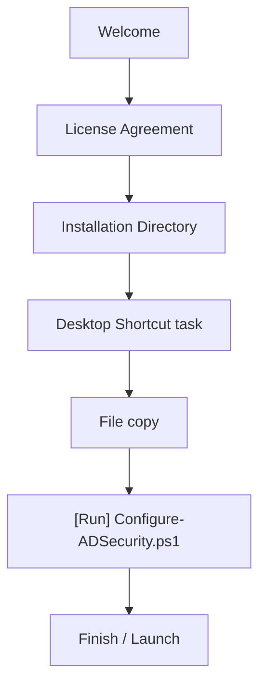
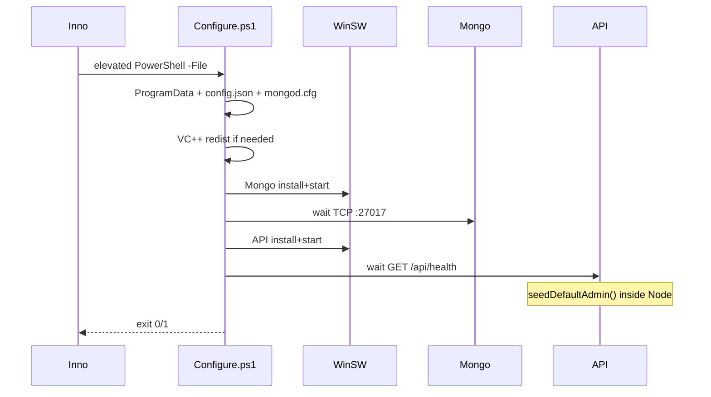
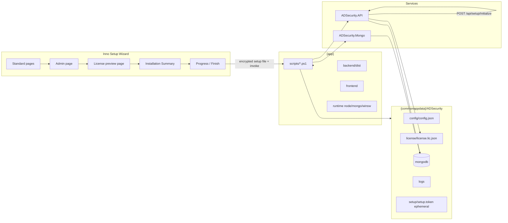
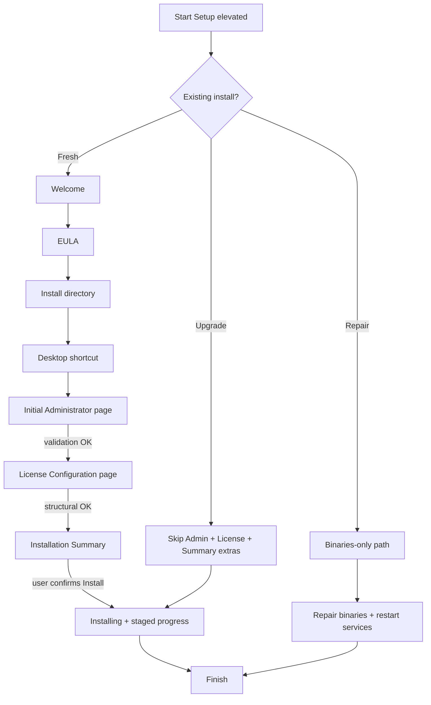

# ADSecurity Installer Redesign Plan

**Status:** Implemented — see `INSTALLER_IMPLEMENTATION_REPORT.md`  
**Goal:** Evolve the existing Inno Setup + PowerShell Configure flow into an enterprise-grade installer (admin bootstrap + license import) **without** rewriting from scratch or breaking Mongo/WinSW/API/update compatibility.

**Review amendments (2026-07-29):** Consolidated bootstrap into a single atomic `POST /api/setup/initialize`; encrypted ephemeral setup file (no CLI passwords); 10-minute one-time setup token; Installation Summary page; Database Initialization progress stage; stricter license ACL (Administrators + SYSTEM only, no inherited Users).

---

## 1. Executive summary

Today the installer is a thin Inno Setup wrapper that copies payload and runs `Configure-ADSecurity.ps1`, which creates ProgramData, installs WinSW services, and waits for health. Admin is seeded as a hardcoded default (`admin@wisibility.ai`) by the backend; license is uploaded later via authenticated UI (`POST /api/license/upload`).

The redesign **extends** this pipeline:

1. Add Inno custom wizard pages (Admin + License + **Installation Summary**) for **fresh installs only**.
2. Extend Configure to perform staged progress (including **Initializing Database…**), then call a **single** first-run API.
3. Backend `POST /api/setup/initialize` atomically creates admin/tenant/roles, imports license, and marks setup complete (with rollback of identity work if license fails).
4. Preserve Repair / Upgrade / Uninstall behaviors with explicit data-preservation rules.

**Separation of concerns (unchanged and endorsed):**

| Layer | Owns |
| --- | --- |
| Inno Setup | Installation experience / wizard |
| Configure.ps1 | Service startup + orchestration |
| Backend | Password hashing, tenant creation, license crypto validation |
| Repair / Upgrade | Preserve user data; skip first-run setup |

---

## 2. Current architecture

### 2.1 Components

| Layer | Path | Role today |
| --- | --- | --- |
| Inno Setup | `installer/ADSecurity.iss` | Wizard (Welcome → License → Dir → Tasks → Install → Finish); copies `payload\`; `[Run]` Configure |
| Configure | `installer/scripts/Configure-ADSecurity.ps1` | ProgramData dirs, `config.json`, `mongod.cfg`, VC++ redist, WinSW Mongo/API install+start, health wait |
| Repair | `installer/scripts/Repair-ADSecurity.ps1` | Recreate folders; re-register/start services; refresh registry |
| Uninstall | `installer/scripts/Uninstall-ADSecurity.ps1` + Inno `[Code]` | Stop/uninstall services; remove `{app}`; optional wipe ProgramData |
| Launch | `installer/scripts/Launch-ADSecurity.ps1` | Start services; open browser |
| WinSW | `installer/templates/ADSecurity.*.xml` | Node API + mongod as Windows services; `NODE_ENV=production`, `ADSecurity_*` |
| Backend boot | `icm-backend/src/server.js` | License validate → Mongo → listen → `seedDefaultAdmin()` |
| License API | `icm-backend/src/routes/licenseRoutes.js` | `GET /status` public; `POST /upload` **auth + SUPER_ADMIN**; `POST /reload` auth |
| Admin seed | `authService.seedDefaultAdmin` | Creates `admin@wisibility.ai` if no `isDefault` user |

### 2.2 Current wizard flow



### 2.3 Current Configure sequence



### 2.4 Current license & admin gaps vs target

| Capability | Today | Target |
| --- | --- | --- |
| Collect admin in wizard | No | Yes (fresh install) |
| Create admin via API | No (`seedDefaultAdmin` only) | Via atomic `POST /api/setup/initialize` |
| Browse `*.lic.json` in wizard | No | Yes (structural preview only) |
| Crypto license validate in installer | N/A | **Forbidden** — backend only |
| Import license post-health | UI `POST /upload` (auth) | Same initialize call (setup-gated) |
| Progress UX stages | Single "Configuring..." | Multi-step enterprise progress + DB init |
| Installation Summary | No | Yes (before file copy) |
| Repair preserves admin/license/DB | Mostly (binaries only) | Explicit guarantee |
| Upgrade skips admin/license pages | No mode detection | Detect + skip |
| Uninstall granular choices | KeepData Y/N only | Multi-checkbox |

### 2.5 Relevant hard-won production lessons (retain)

From prior root-cause work (`CONFIGURE_SCRIPT_FIX_REPORT.md`, etc.):

- PowerShell 5.1: ASCII-only scripts (no em dash / ellipsis).
- `config.json` / `mongod.cfg`: **no UTF-8 BOM**; mongod paths use **forward slashes**.
- Rollback must **not** delete Program Files (retryability).
- mongod needs **VC++ redistributable**.
- WinSW must set `NODE_ENV=production` + `ADSecurity_HOME` / `DATA`.
- Backend payload must include complete `dist` + `node_modules` (or post-copy `npm install --omit=dev`).

---

## 3. Proposed architecture

### 3.1 Design principles

1. **Extend, don't replace** — keep Inno + Configure + WinSW; add pages and one setup API.
2. **Installer is an orchestrator** — no password hashing, no license crypto, no direct Mongo writes.
3. **Backend owns identity & license truth** — single atomic initialize after API health (+ DB ready).
4. **Fresh vs Upgrade vs Repair** — wizard and Configure branch on registry/`version.json`/service presence.
5. **Secrets never on the command line** — encrypted ephemeral setup file; delete immediately after successful API call; never in logs/registry.
6. **Backwards compatible** — existing silent installs without setup file continue (`seedDefaultAdmin`).
7. **UI-agnostic post-install** — same Configure/API contract whether launched via PowerShell, Electron, or a native wrapper later.

### 3.2 Component diagram



### 3.3 Proposed wizard flow



### 3.4 Fresh-install runtime sequence

```mermaid
sequenceDiagram
  participant User
  participant Inno
  participant Cfg as Configure.ps1
  participant Mongo
  participant API
  participant FS as ProgramData

  User->>Inno: Admin fields + license path
  Inno->>Inno: Validate UI; structural license JSON preview
  Inno->>Inno: Show Installation Summary; user confirms
  Inno->>Inno: Write encrypted ephemeral setup file; copy files
  Inno->>Cfg: -SetupFile path only (no secrets on CLI)
  Cfg->>FS: Ensure dirs + ACLs + config.json
  Cfg->>Cfg: VC++ if needed; mongod.cfg
  Cfg->>Mongo: Install/start WinSW; wait healthy
  Cfg->>API: Install/start WinSW; wait /api/health
  Cfg->>API: Wait databaseReady / migrations complete
  Cfg->>FS: Copy *.lic.json to license/; Hidden+System+ACL
  Cfg->>FS: Write one-time setup token (10 min TTL)
  Cfg->>API: POST /api/setup/initialize (token + admin + licensePath)
  API->>API: Admin+tenant+roles; import+activate license; atomic rollback on license fail
  Cfg->>API: GET /api/license/status verify licensed
  Cfg->>FS: Delete setup token + encrypted setup file
  Cfg-->>Inno: exit 0
```

---

## 4. Wizard pages (Inno `[Code]`)

### 4.1 Initial Administrator

| Field | Required | Rules |
| --- | --- | --- |
| Full Name | Yes | Non-empty; trim; max length (e.g. 120) |
| Email | Yes | Non-empty; RFC-like regex; normalize lower-case for API |
| Phone | No | Digits/`+`/`-`/` `/`()`; max length |
| Password | Yes | Policy: min length 12; upper; lower; digit; special (align with backend validator) |
| Confirm Password | Yes | Exact match |

**Security UX:** password edits use password char; values never written to Inno log (`dontlogparameters` / never `Log` edit text).

**Next:** enabled only when all validators pass.

**Upgrade/Repair:** page skipped (`ShouldSkipPage`).

### 4.2 License Configuration

| UI | Behavior |
| --- | --- |
| Browse | `GetOpenFileName` filter `*.lic.json` **only** |
| Display | Filename, Customer Name, Edition, Expiry, Max Users (if present), Validation Status |
| Structural validation (wizard) | Extension, readable, JSON parse, display claims present for preview |
| Crypto validation | **Never in Inno** — status = "Pending backend verification" until initialize |
| Next | Disabled if structural validation fails |

**Gates:**

- **Gate A (wizard):** structural/schema presence for UX preview.  
- **Gate B (post-API, hard fail):** backend initialize cryptographic validation.

### 4.3 Installation Summary (new — before file copy)

Shown after License page, **before** `ssInstall` file copy. Example:

```text
ADSecurity Installation Summary

Install Folder     C:\Program Files\ADSecurity
Administrator      John Doe / john@company.com
License            Enterprise Edition
Customer           ABC Pvt Ltd
Expiry             31-Dec-2028
Desktop Shortcut   Yes

[Install]
```

- No password displayed.
- Confirm button proceeds to installation; Back returns to License/Admin.

### 4.4 Progress page

Staged messages (ASCII-safe strings in any `.ps1`):

1. Installing MongoDB...  
2. Installing API...  
3. Checking Health...  
4. **Initializing Database...** (migrations / seed / indexes — wait until ready)  
5. Creating Administrator...  
6. Importing License...  
7. Verifying License...  
8. Starting Services...  
9. Installation Complete  

**Preferred:** Configure writes `{DataRoot}\logs\installer\progress.json` (`step`, `message`, `percent`, `error`); Inno polls during post-install Exec.

### 4.5 Mode detection

| Mode | Detection | Wizard |
| --- | --- | --- |
| Fresh | No product registry **or** no `{app}\app\backend\dist\server.js` | Full pages including Summary |
| Upgrade | Same `AppId` / registry; newer version | Skip Admin + License + Summary detail; reuse config/license |
| Repair | Repair entry point; DataRoot intact | Skip first-run pages; binaries + service rebind only |

---

## 5. API / backend changes

### 5.1 Setup mode gate (one-time token)

Configure creates:

| Property | Rule |
| --- | --- |
| Path | `{DataRoot}\setup\setup.token` |
| Value | Cryptographically random (32+ bytes hex) + issued-at metadata |
| ACL | **Administrators + SYSTEM only**; disable inheritance; **no Users** |
| Header | `X-ADSecurity-Setup-Token: …` |
| TTL | **Expire after 10 minutes** |
| Use | **Single successful use** then invalidate |
| Cleanup | **Delete immediately** after successful initialize (also on TTL expiry / failed attempts policy) |

Exempt from LICENSE_REQUIRED blocking: `POST /api/setup/initialize` (and existing health/license status as today).

### 5.2 `POST /api/setup/initialize` (single atomic endpoint — **approved design**)

**Do not expose** separate `POST /api/setup/admin` or `POST /api/license/import` for first-run.

**Auth:** setup token; no JWT.

**Body:**

```json
{
  "admin": {
    "name": "...",
    "email": "...",
    "phone": "...",
    "password": "..."
  },
  "licensePath": "C:\\ProgramData\\ADSecurity\\license\\license.lic.json"
}
```

**Backend sequence (transactional intent):**

1. Reject if setup already completed (409).  
2. Validate admin payload + password policy.  
3. Create admin (hash password).  
4. Create tenant.  
5. Seed default roles / settings.  
6. Ensure DB migrations/indexes already applied (or run pending if safe at this point).  
7. Read license file from `licensePath` (must be under DataRoot license dir).  
8. Cryptographically validate + activate via `LicenseManager`.  
9. Mark setup complete; invalidate setup token.  
10. Return safe summaries (admin email, license `toLogSummary()` — **no raw license, no password**).

**Atomicity / rollback:**

- If step 8 (license) fails after steps 3–5: **rollback admin/tenant/role seed** created in this request (delete created records / compensate), leave LICENSE_REQUIRED mode, return clear error.  
- Do not leave a half-initialized tenant without a valid license on a "successful" setup call.  
- Idempotent retries: if prior attempt rolled back cleanly, allow initialize again with same token until success or TTL.

**Interaction with `seedDefaultAdmin`:**

- When setup file / setupMode is active for this boot: **skip** `seedDefaultAdmin`.  
- Legacy silent Configure (no setup file): keep `seedDefaultAdmin`.

### 5.3 In-product license renewal (unchanged path)

Keep `POST /api/license/upload` (auth + SUPER_ADMIN) for post-install renewals. First-run must not depend on it.

### 5.4 Existing endpoints to keep

| Endpoint | Keep |
| --- | --- |
| `GET /api/license/status` | Yes — post-initialize verification |
| `POST /api/license/upload` | Yes — in-product renewal |
| `GET /api/health` | Yes — include/await `databaseReady` / migration completeness signals |

### 5.5 Database initialization stage

Between **API Healthy** and **Create Administrator** (inside Configure progress + optionally inside initialize):

1. Confirm Mongo accepting connections.  
2. Confirm API reports ready (existing health `databaseReady` / `backgroundInitComplete` as applicable).  
3. Ensure migrations have run (API already runs `runPendingMigrations` at boot — Configure **waits** until health reflects ready rather than running migrations from PowerShell).  
4. Only then call `POST /api/setup/initialize`.

This avoids admin/license calls racing incomplete migrations.

---

## 6. Installer / Configure changes

### 6.1 Secrets handoff (encrypted temp file — **approved**)

```text
Inno (elevated)
  -> write encrypted ephemeral setup file under {tmp} or {DataRoot}\setup\
  -> ACL: Administrators + SYSTEM only
  -> pass ONLY -SetupFile "<path>" on Configure command line
Configure
  -> decrypt in memory
  -> POST /api/setup/initialize
  -> delete setup file immediately after successful API call
  -> on failure: delete password material ASAP; never log it
```

**Never leave plaintext credentials in:** temp folder (use encryption at rest for the blob), installer logs, registry, or command line.

**Suggested encryption:** Windows DPAPI (`CryptProtectData` / `ProtectedData`) scoped to LocalMachine (elevated install context) or a random key sealed in an ACL-restricted key file deleted with the blob. Prefer DPAPI LocalMachine for simplicity under the same elevated account chain.

### 6.2 Inno (`ADSecurity.iss`)

| Change | Notes |
| --- | --- |
| EULA | Supply real `LicenseFile` |
| Custom pages | Admin, License preview, Installation Summary |
| Secrets | Encrypted setup file only; `-SetupFile` path on Configure |
| Fail closed | Treat Configure non-zero exit as install failure / error page |
| Upgrade/Repair | Skip first-run pages |
| Uninstall | Granular checkboxes (§9) |
| Never add `postinstall` to Configure | Avoid `runasoriginaluser` elevation drop |

### 6.3 Configure.ps1 extensions (additive)

After existing Mongo/API start + health:

1. Progress: Initializing Database... (poll health until DB/migrations ready).  
2. Ensure dirs: `config`, `license`, `setup`, `cache`, `data`, logs, etc.  
3. ACL license/setup/config: **Administrators + SYSTEM only**; protect from inherited Users.  
4. Hidden + System on `license` folder (not a security boundary).  
5. Copy selected `*.lic.json` → `{DataRoot}\license\license.lic.json` (atomic).  
6. Create setup token (10 min TTL).  
7. Decrypt setup file → `POST /api/setup/initialize`.  
8. `GET /api/license/status` assert licensed.  
9. Delete setup token + encrypted setup file.  
10. On failure: unregister services; **retain Program Files**; surface error.

If `-SetupFile` omitted → legacy Configure (services + health only).

### 6.4 Progress reporting

```json
{ "step": "init_database", "message": "Initializing Database...", "percent": 45, "error": null }
```

No secrets in `progress.json` or installer logs.

### 6.5 Repair / Upgrade

- **Never** re-ask admin, password, or license.  
- Repair: binaries + service rebind only; never wipe DataRoot license/DB/config.  
- Upgrade: file replace + service restart; reuse configuration.

### 6.6 Launch script fix (regression)

Resolve InstallRoot from registry / param — do not hardcode `C:\Program Files\ADSecurity`.

### 6.7 Future Electron / shell compatibility

Post-install contract is Configure + backend APIs only. Electron or a native launcher may replace `Launch-ADSecurity.ps1` later without changing installer orchestration.

---

## 7. License storage & security review

| Control | Plan |
| --- | --- |
| Location | `{commonappdata}\ADSecurity\license\license.lic.json` only |
| Not beside EXE / not in frontend | Enforced by Configure copy target |
| ACL | **Administrators + SYSTEM only**; **disable inheritance**; no Users ACE |
| Attributes | Hidden + System on folder |
| Directory browsing | N/A for NTFS folder; ensure no web static mapping to license path |
| Trust | Signature validation in `LicenseManager` only |
| API | Never return raw license; summary only; no download endpoint |
| Password | Encrypted setup file → memory → POST body → bcrypt; never config/logs/CLI |
| Setup token | 10 min TTL; one successful use; delete immediately after success |

---

## 8. Risk analysis

| Risk | Impact | Mitigation |
| --- | --- | --- |
| Inno / PS encoding | Configure fail | Keep ASCII-only scripts |
| LICENSE_REQUIRED blocks initialize | Setup fails | Exempt `/api/setup/initialize` with valid token |
| `seedDefaultAdmin` races wizard | Wrong admin | Skip seed when setup mode active |
| Structural license OK, crypto fails | Late failure | Clear error; services-only rollback; retain Program Files; allow retry |
| Partial initialize | Orphan admin without license | Atomic rollback of identity seed if license step fails |
| Password on CLI / plaintext temp | Secret leak | Encrypted setup file + immediate delete; never CLI secrets |
| Inno ignores Configure exit | False success | Fail closed on non-zero exit |
| Uninstall helper deletes `{app}` always | Overlap / damage | Split Stop-Services vs wipe |
| Launch hardcodes PF | Custom dir breaks | Registry-based InstallRoot |
| `postinstall` flag | Unelevated Configure | Do not use for Configure |
| VC++ / empty node_modules / bad dist | API/Mongo fail | Retain existing packaging fixes |
| DPAPI / decrypt context mismatch | Configure cannot read setup file | Document LocalMachine scope; same elevated session |

---

## 9. Uninstall redesign

| Checkbox | Default | Effect |
| --- | --- | --- |
| Remove binaries (`{app}`) | Checked | Current behavior |
| Remove services | Checked | WinSW uninstall |
| Remove database | Unchecked | Delete mongodb data |
| Remove uploaded license | Unchecked | Delete `license\` |
| Remove logs | Unchecked | Delete `logs\` |
| Remove config | Unchecked | Delete `config\` |

Default = binaries + stop/uninstall services only — **retain** data/license/DB.

`[UninstallRun]` should call a **stop/unregister services** helper, not a script that always `Remove-Item`s Program Files (Inno removes files itself).

---

## 10. Rollback strategy

| Stage failure | Action |
| --- | --- |
| File copy | Inno native rollback |
| Mongo / API health / DB init wait | Stop/uninstall services; retain `{app}` + ProgramData |
| `initialize` fails (admin or license) | Backend rolls back its own partial identity work; Configure stops services; retain `{app}`; show API error |
| Mid-upgrade | Never delete DataRoot |

Retry: re-run Configure with a **new** encrypted setup file + **new** setup token (old token expired/invalidated).

---

## 11. Migration strategy

| Existing install | Behavior |
| --- | --- |
| v1 with default admin + license | Upgrade skips first-run pages; no re-initialize |
| v1 LICENSE_REQUIRED | Prefer skip wizard license; use in-app upload |
| Broken binaries, good DataRoot | Repair |
| Silent `/VERYSILENT` without setup file | Legacy Configure + `seedDefaultAdmin` |

---

## 12. Implementation phases (post-approval)

| Phase | Deliverable | Gate |
| --- | --- | --- |
| **P0** | Plan approved (this revision) | Stakeholder sign-off |
| **P1** | Backend: setup token (10 min, one-shot) + `POST /api/setup/initialize` with atomic rollback + tests; gate `seedDefaultAdmin` | Unit/integration tests |
| **P2** | Health wait includes DB/migration readiness signal if needed | API boots; initialize blocked until ready |
| **P3** | Configure: `-SetupFile`, DPAPI decrypt, progress.json (incl. DB init), ACL helpers, copy license, call initialize, delete secrets | Legacy Configure still works |
| **P4** | Inno: Admin + License preview + Summary pages; encrypted setup file; fail closed; skip on upgrade | ISS compiles |
| **P5** | Progress UX polish; errors; retry | Manual checklist |
| **P6** | Repair/Upgrade/Uninstall/Launch path fixes | Regression VM |
| **P7** | `INSTALLER_IMPLEMENTATION_REPORT.md` + packaging CI | RC |

**Commit policy:** small incremental commits per phase; each phase remains installable.

---

## 13. Testing strategy (preview)

### Fresh install

1. Valid admin + valid license → initialize OK; login with wizard credentials; SPA on `/`.  
2. Invalid wizard fields → Next disabled.  
3. Non-`*.lic.json` → rejected.  
4. Bad signature → initialize fails; identity rolled back; Program Files retained.  
5. Password never in installer logs or plaintext temp after success.  
6. Setup token rejected after success or after 10 minutes.  
7. Summary page shows correct folder/admin/license preview before copy.

### Upgrade / Repair / Uninstall / Regression

As before: no re-prompt for admin/license; repair preserves data; uninstall defaults retain ProgramData; Mongo/VC++/BOM/ASCII/SPA regressions hold.

---

## 14. Out of scope

- Rewriting licensing crypto or requiring Electron for install.  
- License validation inside Inno.  
- Storing license under `{app}` or frontend.  
- Separate first-run `POST /api/setup/admin` or `POST /api/license/import` (superseded by initialize).

---

## 15. Approval checklist (updated)

| Item | Decision |
| --- | --- |
| Structural license preview in wizard; crypto only in backend | **Accepted** |
| Single `POST /api/setup/initialize` (atomic) | **Accepted** |
| Encrypted ephemeral setup file; no CLI passwords | **Accepted** |
| Setup token: 10 min, one-shot, delete on success | **Accepted** |
| DB initialization wait stage before initialize | **Accepted** |
| Installation Summary page before file copy | **Accepted** |
| License ACL: Administrators + SYSTEM only | **Accepted** |
| Legacy silent install may still seed `admin@wisibility.ai` | **Accepted pending deprecate later** |
| Password policy 12+ complexity (align backend) | **Confirm at P1 if product policy differs** |
| Uninstall default: binaries only | **Accepted** |
| Proceed implementation starting **P1** | **Done** — see `INSTALLER_IMPLEMENTATION_REPORT.md` |

---

## 16. Deliverables after implementation approval

1. Incremental P1–P7 commits.  
2. Updated ISS, Configure, Repair, Uninstall, Launch.  
3. `POST /api/setup/initialize` + tests.  
4. Final **`INSTALLER_IMPLEMENTATION_REPORT.md`**.

---

*Plan revised from review feedback. No code until you approve implementation (P1).*
