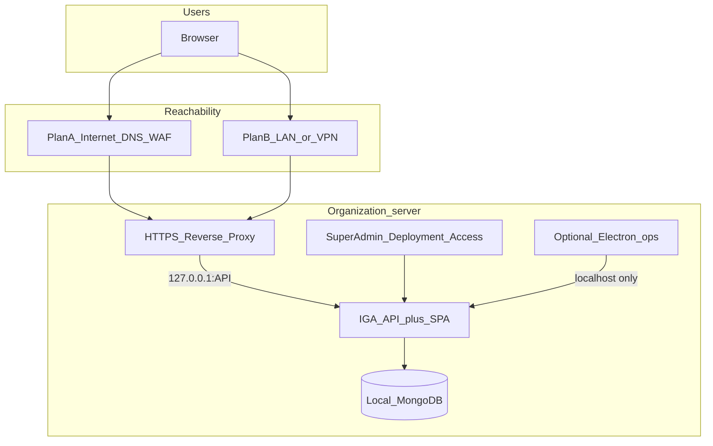

# Wisibility IGA — Organization Deployment Build Plan (Plan A / B)

**Single source of truth.** Lives here in the **development repo** (`D:\Wisi\Wisibility_IGA`) because Phase 0 is built here. Installer phases are executed in `Wisibility_IGA_Client`, tracked in this same file.

---

## Workspace map (locked)

One Cursor workspace, three roles:

| Folder | Path (typical) | Role |
|--------|----------------|------|
| **Wisibility_IGA** | `D:\Wisi\Wisibility_IGA` | **Development** — MERN source of truth (backend + frontend) |
| **Wisibility_IGA_Client** | under `D:\Wisibility_Beta\` | **Customer install / packaging** — Setup.exe, Plan A/B installer |
| **Wisibility_IGA_Partner** | under `D:\Wisibility_Beta\` | **Demo / dummy data** — not the customer installer path |

```text
Wisibility_IGA          → develop & test app
        ↓ pull / sync
Wisibility_IGA_Client   → installer + Plan A/B packaging → ADSecuritySetup.exe
Wisibility_IGA_Partner  → demo / dummy data (separate)
```

### Plan A/B work split

| Work | Where |
|------|--------|
| App (CORS, cookies, trust proxy, Super Admin Deployment UI) | **Wisibility_IGA** first |
| Installer wizard, Configure scripts, docs, EXE | **Wisibility_IGA_Client** |
| Partner demo | No Plan A/B packaging unless aligned later |

---

## Decisions (locked)

| Decision | Choice |
|----------|--------|
| Tenancy | One org = one server + one MongoDB (already true) |
| User access | Browser only (no EXE on employee PCs) |
| Install target | Designated org Windows server only |
| Default exposure | **Plan B** (LAN / VPN) — safer first enterprise default |
| Plan A | Same product; IT exposes HTTPS via DNS + firewall + reverse proxy |
| Config home | **Hybrid** — installer seeds; Super Admin UI updates; IT owns DNS/proxy/TLS |
| App vs network | React + Express same product; **deployment/network layer** differs |
| Electron | Optional **server-local ops console** only; not the end-user path |
| MongoDB | Stays on the org server (`127.0.0.1`); never public |

Today’s installer already binds API/Mongo to `127.0.0.1` (`Wisibility_IGA_Client/installer/scripts/Configure-ADSecurity.ps1`). That is the correct server-behind-proxy posture. Gap = installer fields, public URL/CORS, Super Admin Deployment UI, reverse-proxy docs — **not** a rewrite of IGA features.

---

## What we build (visual)

```text
┌─────────────────────────────────────────────────────────────┐
│  PHASE 0 — Wisibility_IGA (development)                     │
│  ┌─────────────┐  ┌─────────────┐  ┌──────────────────────┐ │
│  │ A1 Public   │  │ A2 CORS     │  │ A3 Trust proxy +     │ │
│  │ URL + Mode  │→ │ from URL    │→ │ cookies behind HTTPS │ │
│  └─────────────┘  └─────────────┘  └──────────┬───────────┘ │
│                                               ▼             │
│                    ┌──────────────────────────────────────┐ │
│                    │ A4 Super Admin → Deployment / Access │ │
│                    │ URL · Plan B/A · CORS · SMTP         │ │
│                    └──────────────────────────────────────┘ │
└──────────────────────────────┬──────────────────────────────┘
                               │ pull / sync
                               ▼
┌─────────────────────────────────────────────────────────────┐
│  PHASE 1 — Wisibility_IGA_Client (packaging)                │
│  ┌────────┐  ┌────────────┐  ┌─────────────┐  ┌──────────┐ │
│  │ B1 Pull│→ │ C1 Wizard  │→ │ C2 config + │→ │ C3 Browser│ │
│  │ code   │  │ URL + mode │  │ TRUST_PROXY │  │ shortcut │ │
│  └────────┘  └────────────┘  └─────────────┘  └────┬─────┘ │
│                                                    ▼       │
│                         ADSecuritySetup.exe            │
└────────────────────────────────────────────────────────────┘
                               │
              ┌────────────────┼────────────────┐
              ▼                ▼                ▼
         Phase 2          Phase 3           Ship
      Plan A harden    Electron = ops     Customer
      + IIS/Nginx docs  console only       checklist
```

| ID | Build item | Repo |
|----|------------|------|
| **A1** | Store public URL + Plan B/A mode | Wisibility_IGA |
| **A2** | CORS from that URL | Wisibility_IGA |
| **A3** | Cookies / trust proxy behind IIS/Nginx | Wisibility_IGA |
| **A4** | Super Admin **Deployment / Access** tab | Wisibility_IGA |
| **B1** | Pull backend + frontend into Client | sync |
| **C1** | Installer wizard: URL + Plan B/A | Wisibility_IGA_Client |
| **C2** | Configure → `config.json` + `TRUST_PROXY` | Wisibility_IGA_Client |
| **C3** | Shortcut opens **browser** | Wisibility_IGA_Client |
| **C4** | Electron = optional server console only | Wisibility_IGA_Client |
| **C5** | Docs (this file + later IIS/Nginx runbooks) | Wisibility_IGA_Client |

**Output:** `ADSecuritySetup.exe`

---

## What we do NOT build

| Not building | Why |
|--------------|-----|
| Separate Plan A app vs Plan B app | Same binaries; network differs |
| EXE on every employee PC | Browser only |
| Cloud DB from Wisibility | Local org MongoDB |
| UI for DNS / firewall / VPN / certs | Customer IT |
| Partner demo changes | Out of scope |

---

## What Customer IT provides (not our code)

| Need | Who | Used by |
|------|-----|---------|
| Windows server | Customer | Setup.exe install target |
| Hostname `iga.abccompany.com` | Customer IT | Browser URL |
| DNS (internal or public) | Customer IT | Plan B or Plan A |
| TLS certificate | Customer IT | HTTPS on reverse proxy |
| Reverse proxy (IIS / Nginx) | Customer IT | HTTPS → `127.0.0.1:API` |
| Firewall / WAF | Customer IT | Plan A |
| VPN | Customer IT | Plan B remote users |

Wisibility provides **Setup.exe** (bundles Node, Mongo, app). Customer does not install Node/Mongo separately.

---

## Hybrid bind — Super Admin vs IT

| Setting | Super Admin UI? |
|---------|-----------------|
| Public URL, Plan B/A, CORS, SMTP, branding | **Yes** |
| Global MFA enforcement | **Phase 2** (requires enrollment flow) |
| DNS, TLS, IIS/Nginx, firewall, VPN, Mongo ports | **No** (Customer IT) |

Installer **seeds** URL/mode on first install; Super Admin **updates** later without reinstall.

---

## Architecture



```text
Internet or LAN/VPN
        │
   :443 HTTPS (IIS / Nginx)
        │
   127.0.0.1:8081   ← IGA API + SPA   (our app)
        │
   127.0.0.1:27017  ← Mongo           (never proxied)
```

| | Plan B (default) | Plan A |
|--|------------------|--------|
| Reach | LAN / VPN | Internet |
| DNS | Internal → private IP | Public → gateway |
| App binaries | Same | Same |
| Extra | VPN if remote | WAF + MFA strongly |

---

## Where changes land by repo

| Area | Repo | Change? | What |
|------|------|---------|------|
| Express CORS / cookies / trust-proxy / public URL | Wisibility_IGA → pull | **Yes (A1–A3)** | Browser-behind-proxy |
| Super Admin Deployment / Access UI | Wisibility_IGA → pull | **Yes (A4)** | URL, mode, CORS, SMTP, MFA guidance |
| React IGA feature screens | Wisibility_IGA | No | Unrelated |
| Mongo models / IGA features | Wisibility_IGA | No | Unrelated |
| Inno + Configure + WinSW + shortcuts | Wisibility_IGA_Client | **Yes (C1–C4)** | Wizard, config, browser launch |
| Deployment docs | Wisibility_IGA_Client | **Yes (C5)** | This file + runbooks |
| Partner demo | Wisibility_IGA_Partner | No | Out of scope |

### Effort (rough)

```text
Installer + docs in Client     ~55%
Backend + Super Admin UI       ~35%
Other React                    ~10%
```

---

## Product changes (detail)

### 1. Wisibility_IGA — backend + Super Admin

- Persist `deployment.mode`, `deployment.publicUrl`, CORS origins
- Wire public URL into email links + CORS
- Cookies/`TRUST_PROXY` safe behind HTTPS proxy
- Plan A: refuse empty CORS / HTTP-only public URL
- New tab: **Deployment / Access** (URL, mode, CORS auto, SMTP, Plan A MFA guidance)
- Endpoint is **Super Admin only** (`GET/PUT /api/settings/deployment-access`); platform `admin` cannot change bind settings
- Global MFA enforcement remains Phase 2 because users need a mandatory enrollment flow before login can be blocked safely

### 2. Wisibility_IGA_Client — installer

Extend Inno + `Wisibility_IGA_Client/installer/scripts/Configure-ADSecurity.ps1`:

- Wizard: Internal (Plan B) | Internet (Plan A) + public URL
- `config.json`: `server.host = 127.0.0.1`, `cors.origins`, `deployment.*`
- WinSW: `TRUST_PROXY=1`
- Shortcut → browser to public URL; Electron optional “Server Console”

### 3. Docs

Under `docs/deployment/`:

- This file (design + checklist)
- Later: Plan B runbook (DNS + IIS/Nginx + VPN)
- Later: Plan A runbook (public DNS + WAF + TLS + harden)

### 4. What we do not change

- Per-org isolated DB and server
- Offline license on org server
- Core IGA React/Express features
- Two separate Plan A / Plan B applications

---

## Gap vs current Client

| Current | Target |
|---------|--------|
| Electron is primary UX | Browser is primary UX |
| CORS / localhost oriented | CORS = org HTTPS hostname |
| Framed as desktop EXE for anyone | Framed as **org server** install |
| No guided Plan A/B | Wizard + Super Admin + docs |
| Proxy assumed loosely | Proxy is the supported edge |

---

## Delivery phases

| Phase | Where | Build | Done when |
|-------|--------|-------|-----------|
| **0 — built** | Wisibility_IGA | A1–A4 | Super Admin sets URL/mode; dynamic CORS and public links update at runtime |
| **1** | Client | B1, C1–C3, C5 | Setup.exe seeds URL/mode; shortcut opens browser |
| **2** | Both | Plan A MFA defaults + IIS/Nginx samples | Plan A checklist pass |
| **3** | Client | C4 | Docs: Electron = optional server console only |

### Phase 0 verification

- [x] Backend production distribution builds
- [x] Frontend production build succeeds
- [x] Deployment/config targeted tests pass (6/6)
- [x] No IDE lint diagnostics in changed files
- [ ] Full backend suite is green (currently 218/220; two unrelated pre-existing assertion failures plus one empty test suite)

---

## Maintenance-mode recovery

Normal production behavior:

- All tenant users receive the maintenance page.
- `/api/auth` remains reachable so a Super Admin can sign in.
- A valid Super Admin session bypasses maintenance and can open **Platform Settings** to turn it off.

Break-glass procedure if Super Admin authentication is unavailable:

1. On the application server, set `MAINTENANCE_MODE_FORCE_OFF=true` in the backend environment.
2. Restart the ADSecurity API service.
3. Repair Super Admin authentication and turn maintenance off in Platform Settings.
4. Remove `MAINTENANCE_MODE_FORCE_OFF` and restart the API again.

This is intentionally a server-access recovery control, not a public bypass URL.

---

## Success criteria

- [ ] One Setup.exe on org server; local DB created automatically
- [ ] Users use **only a browser** at `https://iga.…` (Plan B or A)
- [ ] Super Admin can update Public URL / mode without reinstall
- [ ] Mongo and Node never exposed publicly
- [ ] Same build for both plans; only DNS/firewall/proxy + mode differ

---

## Appendix — Customer checklist (IT handoff)

### Provide
| Item | Required |
|------|----------|
| Setup.exe | Yes |
| License `.lic.json` | Yes |
| This guide | Yes |

### On install
| Step | Required |
|------|----------|
| Windows 64-bit + Admin UAC | Yes |
| License + first admin | Yes |
| Public URL + Plan B/A | Recommended |

### After install

| Task | Plan B | Plan A |
|------|--------|--------|
| Internal DNS | Required | Optional |
| Public DNS | No | Required |
| HTTPS + reverse proxy → `127.0.0.1` | Required | Required |
| Only port 443 | Required | Required |
| VPN if remote | Required | No |
| Firewall/WAF | Light | Required |
| Super Admin: URL, mode, SMTP, security | Required | Required (+ MFA) |
| Users: browser only | Yes | Yes |

### Sign-off
- [ ] Services running; admin login works
- [ ] DNS + HTTPS + proxy OK
- [ ] Public URL set in Super Admin
- [ ] Plan A: MFA + lockout confirmed
- [ ] Test user can open app in browser
